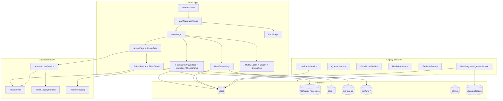

# Auditoria final pós-implementação — Trilha Med / Revalida Cards

**Data:** 2026-05-19  
**Escopo:** R1, F4, V2, S2, S3, S1, F1, Live Events Host Único, RBAC, Painel Mestre  
**Modo:** Somente leitura — **nenhum código alterado**

Documentos de referência: `TECHNICAL_AUDIT.md`, `P0_MIGRATION_PLAN.md`, `ADMIN_UNIFICATION.md`, `USERS_PRIVACY_S1.md`, `F1_USERS_USUARIOS.md`, `OSCE_RELEASE_RB.md`, `LIVE_EVENTS_PHASE_B.md`, `RBAC.md`, `ARCHITECTURE.md`.

---

## Sumário executivo de achados (prioridade)

| ID | Prioridade | Tema | Resumo |
|----|------------|------|--------|
| D1 | **P0** | Deploy | Rules + índices Firestore (OSCE V2, S1, S2/S3, F1, Live host) **devem** ser publicados em conjunto com o build; app novo + rules antigas (ou inverso) quebra lobby OSCE, privacidade ou salas |
| D2 | ~~**P0**~~ **Resolvido** | Segurança | Ver `docs/LIVE_EVENTS_D2.md` — payout + coordenador |
| D3 | **P1** | Segurança | `flashcards` / `questoes`: leitura total para `isSignedIn()` — vazamento de conteúdo pago/admin |
| D4 | **P1** | Segurança | `platform_audit_logs`: `create` para qualquer autenticado — spam / custo |
| D5 | **P1** | Consistência | Rules usam `isAdmin()` (founder + `admins/`) em vários pontos; app usa `isAppAdmin()` (+ `users.isAdmin`) — admin só com flag `isAdmin` edita OSCE mas **não** flashcards/questões nas rules |
| D6 | **P1** | Performance | `getTodasQuestoes()` + `editar_questoes_page` — stream na coleção inteira `questoes` (V1 não implementado) |
| D7 | **P1** | Performance | Home dashboard: `flashcards.snapshots()` coleção inteira + progresso por usuário |
| D8 | **P1** | Produto | Fase Prática (aluno + admin): telas e serviços existem **sem entrada** no menu principal nem em `AdminPage` |
| D9 | **P2** | Código morto | `ProgressoService`, `EditarQuestoesPage`, `TelaFlashcardsPorIds` sem referências |
| D10 | **P2** | RBAC | Permissões `payment.refund`, `notification.broadcast`, `content.write` — seed/matrix sem UI dedicada no Painel Mestre |
| D11 | **P2** | Plataforma | `platform_entitlements`, `watchActiveForUser` — rules/repos prontos, **sem paywall** no app legado |
| D12 | **P2** | Rules | `isOscePerformanceOnlyUpdate` — write cross-user em `users`; sem uso claro no cliente atual |
| D13 | **P2** | Assets | `assets/sounds/beep.mp3` declarado no `pubspec` — risco de runtime se usado |
| D14 | **P3** | Arquitetura | Dupla stack legado (`lib/services`) + plataforma (`PlatformRegistry`) — manutenção duplicada |
| D15 | **P3** | Docs | `usuarios` read-only; migração F1 no login — validar em produção com inventário Firestore |

### Status das entregas P0 (implementação)

| Entrega | Estado no código | Risco residual |
|---------|------------------|----------------|
| R1 + F4 Admin unificado | `AdminAccessService` + `AdminGate` + delegação | D5 rules vs app |
| V2 + S2 + S3 OSCE | Query filtrada + rules salas/meta | D1 deploy índice |
| S1 Privacidade | `users` read restrito + `public_profile` | D2 write cross-user XP |
| F1 users/usuarios | Migração login; `usuarios` read-only | Inventário dados legados |
| Live Host único | `hostId`, coordinator, rules | Eventos antigos sem `hostId` |
| RBAC + Painel Mestre | 11 módulos, guards, audit | Permissões sem UI (D10) |

---

# 1. Relatório executivo (proprietário)

## O que foi conquistado

O aplicativo passou de um modelo **permissivo e fragmentado** para uma base **defensável em produção** nas áreas críticas:

- **Administração:** um único critério de acesso (`AdminAccessService` + RBAC), Painel Mestre com 11 módulos e auditoria de permissões.
- **OSCE multiplayer:** lobby mais escalável (query por status), salas e metadados protegidos por regras.
- **Privacidade:** perfis completos de outros usuários não são mais legíveis por padrão; perfil público mínimo preparado.
- **Dados:** progresso oficial em `users`; coleção `usuarios` preservada só para migração.
- **Live Events:** apenas host ou admin avança rodadas; menos caos em eventos simultâneos.

## O que ainda impede escala e monetização tranquila

1. **Deploy coordenado** — alterações de segurança estão no repositório; Firestore em produção precisa receber rules e índices antes ou junto do app.
2. **Conteúdo aberto** — flashcards e questões ainda são legíveis por qualquer conta logada (regra Firestore).
3. **Monetização não plugada** — planos, assinaturas e pagamentos existem no Painel Mestre, mas o fluxo do aluno **não** verifica assinatura ativa.
4. **Funcionalidades “fantasma”** — Fase Prática (conteúdo rico) não aparece no menu; investimento de desenvolvimento sem uso.
5. **Abuso residual** — concessão de XP em Live Events ainda permite escrita em documentos de outros usuários (regra ampla).

## Recomendação estratégica

| Horizonte | Foco |
|-----------|------|
| **Imediato (1–2 semanas)** | Deploy rules/índices; fechar D2 e D5; inventário Firestore `usuarios` |
| **Pré-beta (3–6 semanas)** | Paywall mínimo; restringir leitura de conteúdo; expor Fase Prática ou arquivar |
| **Pós-beta** | Cloud Functions (rodadas Live, contador OSCE); unificar `isAppAdmin` nas rules |

**Veredito:** O projeto está **apto para beta fechado** com admins e grupo de teste, desde que o deploy Firestore seja executado e os itens P0/P1 acima tenham dono. **Não** recomendado beta público amplo ou campanha paga sem paywall e hardening de conteúdo.

---

# 2. Relatório técnico (desenvolvedor)

## 2.1 Inconsistências remanescentes

### Admin: `isAdmin()` vs `isAppAdmin()` nas rules

| Recurso | Write rule | Inclui `users.isAdmin`? |
|---------|------------|-------------------------|
| OSCE cases, fase prática | `isOsceCaseEditor()` → `isAppAdmin()` | Sim |
| `flashcards`, `questoes` | `isAdmin()` | **Não** |
| `global_messages` | `isAdmin()` | **Não** |
| Painel / platform_* | `isAppAdmin()` | Sim |

**Efeito:** conta com `users.isAdmin == true` sem doc em `admins/` passa no app (`AdminAccessService`) mas pode falhar ao editar flashcards via Firestore.

**Correção sugerida:** substituir `isAdmin()` por `isAppAdmin()` nas rules legadas de conteúdo (ou documentar que grant admin deve sempre criar `admins/{uid}`).

### RBAC vs Admin legado

- `AdminLegacyCompat` grava `rbacRoles` se vazio — alinhado a F4.
- `grantAdmin` atualiza `admins`, `isAdmin`, RBAC e auditoria — OK.
- Ferramentas admin legadas (`AdminPage` → flashcards, questões, OSCE) **não** usam `RbacGuard` por botão — só `AdminGate` na entrada.

### Live Events: eventos sem `hostId`

- `canActAsEventCoordinator`: se `!ev.hasHost`, só admin coordena.
- Eventos antigos precisam backfill `hostId` ou coordenação manual admin.

## 2.2 Código morto e órfãos

| Item | Evidência | Ação sugerida |
|------|-----------|---------------|
| `ProgressoService` | Nenhum import em `lib/` | Remover ou manter só como doc `@Deprecated` |
| `EditarQuestoesPage` | Zero navegação | Remover ou ligar ao admin questões |
| `TelaFlashcardsPorIds` | Zero navegação | Remover ou usar no cronograma |
| `AdminPracticalPhaseListPage` (+ form, modules) | Não linkado em `AdminPage` | Adicionar botão admin ou remover |
| `PracticalPhaseLandingPage` | Não linkado na `HomePage` | Botão “Fase Prática” ou remover feature flag |

## 2.3 Serviços órfãos / subutilizados

| Serviço / módulo | Uso real |
|------------------|----------|
| `PlatformRegistry` + repos | Painel Mestre, RBAC audit, dashboard |
| `watchActiveForUser` (subscriptions) | **Não** chamado em flashcards/OSCE/simulado |
| `UserPublicProfileService` | Login + perfil; **nenhuma** tela lê perfil de terceiros ainda |
| `UserProgressMigrationService` | Login apenas |
| `MasterAdmin*Page` (pagamentos refund UI) | Lista/visualização; sem fluxo refund |

## 2.4 Regras Firestore vs uso do app

| Rule / função | Usada pelo app? | Notas |
|---------------|-----------------|-------|
| `usuarios` read-only | Migração F1 | OK |
| `public_profile` read signedIn | Sync escrita; leitura futura | OK |
| `isLiveEventRewardGrant` | `grantRewardsToUser` | **Muito ampla** (D2) |
| `isOscePerformanceOnlyUpdate` | Sem grep em writes | Legado / futuro |
| `platform_entitlements` | Sem cliente | Preparado |
| `platform_audit_logs` create signedIn | `RbacService`, `AdminAccessService` | Qualquer user pode criar log |

## 2.5 Permissões RBAC não utilizadas na UI

| Permissão | No seed | UI Painel Mestre |
|-----------|---------|------------------|
| `admin.panel.access` | Sim | Via `AdminGate` / shell |
| `dashboard.view` | Sim | Dashboard |
| `user.manage` | Sim | Usuários |
| `subscription.manage` | Sim | Assinaturas + Planos |
| `seller.manage` | Sim | Vendedores |
| `affiliate.manage` | Sim | Afiliados |
| `coupon.manage` | Sim | Cupons |
| `partnership.manage` | Sim | Parceiros |
| `ad.manage` | Sim | Propagandas |
| `audit.read` | Sim | Auditoria |
| `platform.settings` | Sim | Configurações |
| `rbac.manage` | Sim | Settings (parcial) |
| `payment.view` | Sim | Via subscriptions/payments repos |
| **`payment.refund`** | Sim | **Sem tela** |
| **`notification.broadcast`** | Sim | **Sem guard** — mensagem global usa `AdminPage` direto |
| **`content.write`** | Sim | **Sem guard** — admin conteúdo legado |

## 2.6 Coleções Firestore

Ver **§4 Mapa de coleções**. Coleções com rules mas **sem** leitura/escrita no app legado:

- `users/{uid}/platform_entitlements`
- `usuarios` (somente migração)

## 2.7 Telas inacessíveis (sem `Navigator` de entrada)

| Tela | Entrada esperada | Estado |
|------|------------------|--------|
| `PracticalPhaseLandingPage` | Home / menu | **Inacessível** |
| `AdminPracticalPhaseListPage` | AdminPage | **Inacessível** |
| `EditarQuestoesPage` | Admin | **Inacessível** |
| `TelaFlashcardsPorIds` | Cronograma? | **Inacessível** |
| Demais fluxos aluno/admin principais | Home, Admin, OSCE | OK |

## 2.8 Dependências (`pubspec.yaml`)

| Pacote | Uso | Observação |
|--------|-----|------------|
| `flutter_quill` + extensions | Admin rich text OSCE/prática | Pesado; necessário |
| `universal_html` | Upload web? | Verificar se indispensável |
| `audioplayers` | Timer OSCE? | OK se usado |
| `connectivity_plus`, `http` | Update service / rede | OK |

Nenhuma dependência claramente **não utilizada** sem análise mais profunda; prioridade baixa.

## 2.9 Gargalos de performance

| Local | Problema | Prioridade |
|-------|----------|------------|
| `QuestaoService.getTodasQuestoes()` | Snapshot em `questoes` inteira | P1 |
| `home_page` / dashboard | `flashcards.snapshots()` global | P1 |
| `admin_questoes_materias_page` | `questoes.snapshots()` | P1 |
| `busca_flashcard_delegate` | Stream flashcards | P1 |
| `master_admin_users_page` | `users.limit(100)` — OK admin | P3 |
| OSCE lobby | Query filtrada V2 | **Resolvido** no código |
| `live_events` `orderBy scheduledAt` | Sem índice explícito no JSON | P2 se query falhar |

## 2.10 Riscos de deploy

1. Ordem: **índices** (`osce_rooms` status+roomNumber) → **rules** → **app**.
2. Staging: teste OSCE 2 contas; Live host; criar sala; login com conta `usuarios` legado.
3. Rollback por release documentado em `OSCE_RELEASE_RB.md`, `USERS_PRIVACY_S1.md`, `F1_USERS_USUARIOS.md`.

## 2.11 Riscos de escalabilidade

| Área | Limite atual | Mitigação futura |
|------|--------------|------------------|
| Firestore reads | Home + busca leem coleções inteiras | Paginação, cache, Cloud Functions agregadores |
| Live Events | N clients na mesma rodada (mitigado host único) | Cloud Function `advanceRound` |
| OSCE salas | Query por status — OK até milhares com índice | Lifecycle `ended` + TTL opcional |
| Admin dashboard | `count()` e queries em `users` | BigQuery export / agregados diários |
| RBAC catalog | Stream roles em cada `loadCatalog` | Cache local + TTL |

---

# 3. Mapa completo do sistema



### Fluxo do aluno (ativo)

`Login` → `MainNavigation` (Home | Perfil) → matérias/temas → flashcards / questões / simulado / cronograma / OSCE (botão “Fase Prática” abre **OSCE**, não Fase Prática editorial).

### Fluxo admin (ativo)

Gesto 4s / teste → `AdminPage` (`AdminGate`) → conteúdo legado **ou** Painel Mestre (`dashboard.view`).

### Fluxo plataforma (parcial)

Painel Mestre CRUD comercial + auditoria; **sem** cobrança no checkout do aluno.

---

# 4. Mapa de coleções Firestore

| Coleção / path | Finalidade | App legado | Painel Mestre | Rules (resumo) |
|----------------|------------|------------|---------------|----------------|
| `users/{uid}` | Perfil privado, XP, flags | Sim | Sim | Read owner/admin; write owner/admin + exceções |
| `users/{uid}/public_profile/profile` | Nome/foto públicos | Sync | — | Read signedIn; write owner |
| `users/{uid}/progresso` | Flashcards SRS | Sim | — | Sub: owner/admin |
| `users/{uid}/progresso_questoes` | Questões | Sim | — | Sub: owner/admin |
| `users/{uid}/simulados_historico` | Simulados | Sim | — | Sub: owner/admin |
| `users/{uid}/cronograma_*` | Cronograma | Sim | — | Sub: owner/admin |
| `users/{uid}/questao_reports` | Reports | Sim | — | Sub: owner/admin |
| `users/{uid}/platform_notifications` | In-app | Futuro | Sim | Owner/admin |
| `users/{uid}/platform_entitlements` | Direitos | **Não** | Futuro | Owner/admin |
| `admins/{uid}` | Admin legado | Sim | — | Founder CRUD |
| `usuarios/{uid}/progresso` | **Legado F1** | Migração | — | Read-only |
| `flashcards` | Conteúdo | Sim | Admin | Read all; write isAdmin |
| `questoes` | Conteúdo | Sim | Admin | Read all; write isAdmin |
| `osce_cases` | Casos OSCE | Sim | Admin | isAppAdmin editor |
| `osce_rooms` + `participants` | Multiplayer | Sim | — | S2 restritivo |
| `osce_meta` | Contador salas | Sim | — | S3 incremento |
| `osce_evaluations` | Avaliações | Sim | — | Evaluator |
| `live_events` + `participants` | Eventos | Sim | Admin | Host/admin coord |
| `practical_phase_models` | Fase prática | Serviço | Admin | Published read |
| `practical_phase_modules` | Landing módulos | Serviço | Admin | Published read |
| `notificacoes_admin` | Suporte | Sim | Admin | Create signedIn |
| `global_messages` | Broadcast popup | Sim | Admin | Read signedIn |
| `platform_subscription_plans` | Planos | — | Sim | Catalog |
| `platform_subscriptions` | Assinaturas | — | Sim | Owner/admin |
| `platform_payments` | Pagamentos | — | Sim | Owner/admin |
| `platform_sellers` | Vendedores | — | Sim | Catalog |
| `platform_affiliates` | Afiliados | — | Sim | Catalog |
| `platform_coupons` | Cupons | — | Sim | Catalog |
| `platform_partnerships` | Parceiros | — | Sim | Admin |
| `platform_advertisements` | Ads | — | Sim | Catalog |
| `platform_audit_logs` | Auditoria | Escrita app | Sim | Read admin; create signedIn |
| `platform_rbac_roles` | Papéis | RBAC seed | Settings | Read signedIn |
| `platform_rbac_permissions` | Permissões | RBAC seed | Settings | Read signedIn |

---

# 5. Mapa de permissões RBAC

## Papéis (`AppRole`)

| Papel | Chave | Uso |
|-------|-------|-----|
| Master | `masterAdmin` | Founder + seed |
| Admin | `admin` | Operação plataforma |
| Suporte | `support` | Painel + usuários + audit read |
| Vendedor | `seller` | Dashboard + content read |
| Usuário | `user` / `student` | `content.read` |
| Afiliado / Parceiro / Financeiro | `affiliate`, `partner`, `finance` | Comercial futuro |

## Permissões (`AppPermission`)

| Chave | Painel Mestre | Admin legado | Aluno |
|-------|---------------|--------------|-------|
| `admin.panel.access` | Entrada admin | AdminGate | — |
| `dashboard.view` | Dashboard | Botão Painel Mestre | — |
| `user.manage` | Usuários | — | — |
| `subscription.manage` | Assinaturas, Planos | — | — |
| `payment.view` | (repos pagamentos) | — | — |
| `payment.refund` | **Sem UI** | — | — |
| `seller.manage` | Vendedores | — | — |
| `affiliate.manage` | Afiliados | — | — |
| `coupon.manage` | Cupons | — | — |
| `partnership.manage` | Parceiros | — | — |
| `ad.manage` | Propagandas | — | — |
| `audit.read` | Auditoria | — | — |
| `platform.settings` | Configurações | — | — |
| `rbac.manage` | Settings | — | — |
| `notification.broadcast` | **Sem guard** | Mensagem global | — |
| `content.read` | Implícito admin | Estudo | Estudo |
| `content.write` | **Sem guard** | CRUD conteúdo | — |

## Resolução de acesso admin (pós R1+F4)

```text
AdminAccessService.resolveAdminAccess()
  → RbacService.resolveContext()  [users doc + rbacRoles + legacy signals]
  → PermissionContext.canAccessAdminPanel
```

Legado ainda ativo: `admins/`, `users.isAdmin`, e-mail founder, backfill `rbacRoles`.

---

# 6. Roadmap recomendado — monetização

| Fase | Prazo sugerido | Entregas | Dependências |
|------|----------------|----------|--------------|
| **M0** | Semana 1 | Deploy P0 rules/índices; fechar D2/D5 | Infra |
| **M1** | Semanas 2–3 | `watchActiveForUser` antes de simulado/OSCE premium; tela “Assinatura” no perfil | `platform_subscriptions` |
| **M2** | Semanas 4–5 | Stripe ou Mercado Pago + webhook → `platform_payments` | Cloud Functions |
| **M3** | Semanas 6–7 | Cupons + vendedores/afiliados (atribuição) | Painel já existe |
| **M4** | Semanas 8–10 | `platform_entitlements` + feature flags por plano | M1–M2 |
| **M5** | Semanas 11–12 | Propagandas (`platform_advertisements`) no feed home | Opcional |

**KPIs:** conversão trial → pago, churn 30d, ARPU, custo Firestore por MAU.

---

# 7. Roadmap recomendado — lançamento beta

## Beta fechado (4–6 semanas)

| Semana | Atividades |
|--------|------------|
| 1 | Deploy Firestore; checklist OSCE/Live/admin; inventário `usuarios` |
| 2 | Corrigir P0/P1 segurança (XP grant, `isAppAdmin` rules, audit log) |
| 3 | Testes 20–50 usuários: flashcards, questões, OSCE 2p, 1 Live Event |
| 4 | Métricas crash + `permission-denied` no Crashlytics |
| 5–6 | Ajustes UX sem escopo novo; documentação suporte |

**Critérios go/no-go beta:**

- [ ] Zero P0 aberto
- [ ] Lobby OSCE e criar sala OK em produção
- [ ] Admin unificado consistente para 3 perfis de teste
- [ ] S1: aluno não lê email de outro aluno

## Beta aberto / loja (8–12 semanas após fechado)

| Item | Obrigatório |
|------|-------------|
| Paywall mínimo (M1) | Sim |
| Política privacidade + termos | Sim |
| Restringir leitura `questoes`/`flashcards` | Sim |
| Remover ou publicar Fase Prática | Sim |
| Cloud Function Live rodadas (opcional hardening) | Recomendado |
| Testes carga OSCE 50+ salas abertas | Recomendado |

## Checklist de deploy consolidado

- [ ] `firebase deploy --only firestore:indexes`
- [ ] Aguardar índice `osce_rooms` ativo
- [ ] `firebase deploy --only firestore:rules`
- [ ] Build app com V2, S1, F1, Live B, Admin unified
- [ ] `dart run tool/f1_validate_usuarios_refs.dart`
- [ ] Smoke: login, flashcard, questão, OSCE, Live host, admin, Painel Mestre

---

## Referências removidas / unificadas (pós trabalhos)

| Antes | Depois |
|-------|--------|
| `AdminGate`: legacy OR rbac | `AdminAccessService` único |
| OSCE lobby full scan | Query `status in (...)` |
| `users` read all signedIn | Owner + admin |
| `ProgressoService` → `usuarios` | `users` + migração |
| Live: qualquer client avança rodada | Host ou admin |

## Referências ainda existentes (intencional)

| Item | Motivo |
|------|--------|
| `FirestorePaths.usuarios` | Migração F1 |
| `admins` + `users.isAdmin` | Compat F4 |
| `isAdmin()` em rules flashcards | D5 — alinhar |
| Coleção `usuarios` no Firestore | Não deletada |

---

*Fim da auditoria. Para detalhes de implementação por release, ver docs específicos listados no cabeçalho.*
