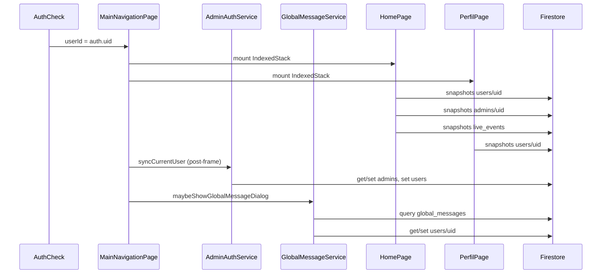

# Auditoria `permission-denied` — Firestore (pós S1, F1, D2, R1/F4, OSCE R-B, Live Host)

**Data:** 2026-05-19  
**Modo:** Somente leitura — **nenhum código alterado**  
**Objetivo:** Mapear consultas no arranque, comparar com `firestore.rules`, identificar bloqueios prováveis e plano de correção mínimo.

**Referências:** `firestore.rules`, `docs/USERS_PRIVACY_S1.md`, `docs/F1_USERS_USUARIOS.md`, `docs/LIVE_EVENTS_D2.md`, `docs/OSCE_RELEASE_RB.md`, `docs/FINAL_AUDIT_POST_IMPLEMENTATION.md` (D1).

---

## Resumo executivo

| Conclusão | Detalhe |
|-----------|---------|
| **Arranque típico (aluno, sessão persistida)** | As consultas Firestore disparadas em `MainNavigationPage` + `HomePage` + `PerfilPage` **devem ser permitidas** pelas regras atuais do repositório, desde que o usuário esteja autenticado e as **rules/indexes estejam publicados** no projeto `revalida-cards`. |
| **Causa mais provável do erro em produção** | **D1 — deploy desalinhado** (app novo + rules antigas no Firebase, ou rules S1 publicadas sem índices/coleções esperadas). O sintoma é idêntico: `FirebaseError: permission-denied`. |
| **Causa provável se o erro aparece em fluxo admin** | Leitura de `users` em lote (`MasterAdminUsersPage`, dashboard) sem `isAppAdmin()` efetivo; ou `ensureDefaultSeed` em RBAC (escrita em `platform_rbac_*` por não-admin). |
| **Causa provável pós-login (não cold start)** | `UserProgressMigrationService` lendo `usuarios/{uid}/progresso` — permitido para dono; **escrita** em `usuarios` falharia (F1 `write: false`), mas o código só lê. |
| **Pós D2** | Crédito de XP direto em `users/{outro}` sem payout → **negado por design** (correto). |

**Próximo passo operacional (sem alterar código):** no [Firebase Console](https://console.firebase.google.com) → Firestore → **Rules** → comparar com `firestore.rules` do repo; em **Requests** / logs, filtrar `permission-denied` e anotar **path + operação** no instante do erro.

---

## Fase 1 — Consultas Firestore no arranque do app

### 1.1 Cadeia de inicialização

```
main()
  → Firebase.initializeApp
  → configureFirestoreForOffline()     // sem I/O remoto
  → StudyTimerService.loadSettings()   // SharedPreferences
  → TrilhaMedApp → AuthCheck (authStateChanges)

Se user == null OU !emailVerified:
  → LoginPage                          // Firestore só após login explícito (§1.3)

Se user != null && emailVerified:
  → MainNavigationPage(userId: user.uid)
       IndexedStack (monta Home + Perfil imediatamente)
       postFrameCallback:
         1. AdminAuthService.syncCurrentUser()
         2. precacheAllBundledFlashcardImages()  // assets locais
         3. GlobalMessageService.maybeShowGlobalMessageDialog()
```

**Importante:** `AuthCheck` **não** chama `UserProfileService.ensureUserDocument()` em sessão persistida — só login/biometria/registro. Migração F1 e `public_profile` rodam **apenas no login**.

### 1.2 Tabela — consultas no arranque (sessão já logada)

| # | Ordem | Arquivo | Método / widget | Operação | Coleção / path |
|---|-------|---------|-----------------|-----------|----------------|
| A | 1 (pós-frame) | `lib/services/auth/admin_auth_service.dart` | `syncCurrentUser` | `get` | `admins/{auth.uid}` |
| B | 2 (founder) | idem | `syncCurrentUser` | `set` merge | `admins/{auth.uid}` |
| C | 3 | idem | `syncCurrentUser` | `set` merge | `users/{auth.uid}` |
| D | 4 (pós-frame) | `lib/services/global_message_service.dart` | `maybeShowGlobalMessageDialog` | `get` query | `global_messages` (orderBy versao, limit 5) |
| E | 5 | idem | idem | `get` | `users/{userId}` |
| F | 6 (se diálogo) | idem | idem | `set` merge | `users/{userId}` (`ultimaMensagemVisualizada`) |
| G | imediato | `lib/screens/home_page.dart` | `build` → StreamBuilder | `snapshots` | `users/{userId}` |
| H | imediato | idem | StreamBuilder aninhado | `snapshots` | `admins/{userId}` (não-founder) |
| I | imediato | `lib/widgets/events/events_section.dart` | `streamPublishedEvents` | `snapshots` query | `live_events` (orderBy `scheduledAt`, limit 30) |
| J | imediato | `lib/screens/perfil_page.dart` | `build` → StreamBuilder | `snapshots` | `users/{userId}` |

**Não disparam no arranque da Home principal:**

| Recurso | Motivo |
|---------|--------|
| `flashcards` coleção inteira | Só em `HomeDashboardPage` (após tocar “Flashcards”) |
| `osce_evaluations` / `PerformanceHomeSection` | Só em `OsceLobbyPage` |
| `osce_rooms` lobby query | Só ao abrir “Fase Prática” |
| `platform_rbac_*` | Só via `RbacService.loadCatalog` (admin / Live play coordinator / Painel Mestre) |
| `usuarios/*` migração F1 | Só em `UserProfileService.ensureUserDocument` no **login** |
| `users` listagem / `count()` | Só Painel Mestre (`MasterAdminUsersPage`, `_AdminDashboardRepo`) |

### 1.3 Arranque alternativo — após login / registro

| # | Arquivo | Método | Operações |
|---|---------|--------|-----------|
| K | `lib/services/auth/user_profile_service.dart` | `ensureUserDocument` | `users/{uid}` set; `syncCurrentUser` (A–C); `public_profile` set |
| L | `lib/services/user_progress_migration_service.dart` | `migrateLegacyProgressIfNeeded` | `get` `usuarios/{uid}/progresso/*`; `set` `users/{uid}/progresso/*` |
| M | `lib/services/auth/user_public_profile_service.dart` | `syncFromAuthUser` | `set` `users/{uid}/public_profile/profile` |

Erros aqui são engolidos para perfil público e migração (`catch` não bloqueia login), mas podem aparecer no **debug console**.

---

## Fase 2 — Comparação consulta × regra (`firestore.rules`)

Legenda: **OK** = permitido para aluno autenticado dono do `userId`; **NEG** = negado; **COND** = depende de papel/deploy.

| ID | Consulta | Regra aplicável | Resultado esperado |
|----|----------|-----------------|-------------------|
| A | `admins/{auth.uid}` read | `match /admins/{adminId}` → `read: isSignedIn() && (uid == adminId \|\| isAdmin())` | **OK** |
| B | `admins/{auth.uid}` set (founder) | `create, update: isFounder()` | **OK** só founder |
| C | `users/{auth.uid}` set merge | `create: isOwner`; `update: isOwner \|\| …` | **OK** |
| D | `global_messages` query | `read: isSignedIn()` | **OK** se autenticado |
| E | `users/{userId}` get | `read: isOwner(userId) \|\| isAppAdmin()` | **OK** se `userId == auth.uid` |
| F | `users/{userId}` update ack | `update: isOwner \|\| …` | **OK** dono |
| G–J | `users/{userId}` snapshots (×2 telas) | idem read | **OK** dono |
| H | `admins/{userId}` snapshots | read próprio doc | **OK** |
| I | `live_events` query | `read: isSignedIn()` | **OK** |
| K–M | login path | subcoleções `users`, `usuarios` read owner, `usuarios` write false | **OK** leitura; escrita só em `users` |

### Funções auxiliares relevantes

```text
isAppAdmin() = isFounder() || exists(admins/uid) || (exists(users/uid) && users.isAdmin == true)
isOwner(userId) = signedIn && auth.uid == userId
```

Leitura de `users/{auth.uid}` dentro de `isAppAdmin()` em **outras** regras usa `get(users/auth.uid)` — permitido porque o avaliador é dono do próprio documento.

---

## Fase 3 — Quais consultas podem estar sendo negadas

### 3.1 Arranque padrão (aluno) — análise estática

**Nenhuma** das consultas A–J lê `users/{outroUid}` nem faz query na coleção `users` sem filtro de dono.

➡️ Com rules do repositório **publicadas** e `request.auth` válido, **não há bloqueio lógico** no arranque para aluno.

Se o erro aparece **ao abrir o app** na Home, investigar nesta ordem:

1. **Rules no Firebase ≠ `firestore.rules` do repo** (D1).
2. **`request.auth == null`** em requisições muito precoces (raro; verificar se o erro ocorre antes de `authStateChanges` estabilizar).
3. **`userId` passado ≠ `auth.uid`** (não ocorre em `AuthCheck`, mas possível em deep link / bug de navegação).
4. Confundir com **`failed-precondition`** (índice composto ausente) — mensagem diferente, mas UI genérica pode mostrar só “erro”.

### 3.2 Cenários fora do arranque com `permission-denied` confirmado por regras

| Cenário | Arquivo | Método | Coleção | Por que nega |
|---------|---------|--------|---------|--------------|
| Listar todos usuários (aluno) | `master_admin_users_page.dart` | `build` StreamBuilder | `users` limit 100 | Query retorna docs de **outros** uids; regra exige `isOwner \|\| isAppAdmin` **por documento** → query inválida para não-admin |
| Dashboard contagem usuários | `firestore_platform_repositories.dart` | `_AdminDashboardRepo.loadSnapshot` | `users` count / where | Agregados sobre coleção inteira sem ser admin |
| RBAC seed por aluno | `firestore_rbac_repository.dart` | `ensureDefaultSeed` | `platform_rbac_permissions`, `platform_rbac_roles` | `create: isAppAdmin()` — aluno que dispara `loadCatalog` falha no `batch.commit` (capturado em `RbacService`, log `[RbacService] loadCatalog fallback`) |
| Revogar admin lendo alvo | `admin_auth_service.dart` | `revokeAdmin` | `users/{targetUid}` get | **OK** se ator é `isAppAdmin()`; **NEG** se ator não é admin |
| Grant/sync RBAC outro uid | `admin_legacy_compat.dart` | `syncRbacAfterGrant` | `users/{targetUid}` get/set | **NEG** se ator não admin |
| Escrever em `usuarios` | qualquer cliente legado | — | `usuarios` | F1: `allow write: if false` |
| XP em outro usuário (Live) | `live_event_service.dart` | reward sem payout | `users/{outro}` | D2: exige `reward_payouts` + `isLiveEventRewardGrantToUser` |
| Criar sala OSCE (meta) | `osce_room_service.dart` | `_allocateRoomNumberTransaction` | `osce_meta/counters` | `update` só `isAppAdmin()` ou incremento validado; falha se transação não atende `isOsceMetaCounterUpdate` |
| Flashcards write só `isAdmin()` | rules | — | `flashcards` | Conta com só `users.isAdmin` sem `admins/{uid}` → **NEG** em write (D5 auditoria final) |

### 3.3 Disparo indireto no fluxo Live Event (não arranque, mas comum)

`LiveEventPlayPage.initState` → `_loadCoordinatorFlags()` → `AdminAuthService.resolveAccess()` → `RbacService.resolveContext()` → `loadCatalog()` → `ensureDefaultSeed()`.

- **Leituras** `platform_rbac_*`: OK (`read: isSignedIn()`).
- **Escrita seed**: NEG para aluno se catálogo vazio (não quebra UI por fallback local).

---

## Fase 4 — Matriz detalhada (bloqueios confirmados por regras)

### 4.1 Arranque — status por consulta

| Arquivo | Método | Coleção | Regra que aplica | Bloqueia aluno? | Motivo se bloquear |
|---------|--------|---------|------------------|-----------------|-------------------|
| `admin_auth_service.dart` | `syncCurrentUser` | `admins/{uid}` | L88–90 | Não | Leitura do próprio doc |
| `admin_auth_service.dart` | `syncCurrentUser` | `users/{uid}` | L96–104 | Não | `set` merge como dono |
| `global_message_service.dart` | `maybeShowGlobalMessageDialog` | `global_messages` | L379–381 | Não* | *Se não autenticado → sim |
| `global_message_service.dart` | idem | `users/{uid}` | L96–98 | Não | `get`/`set` dono |
| `home_page.dart` | `build` | `users/{uid}` | L96–98 | Não | Stream dono |
| `home_page.dart` | `build` | `admins/{uid}` | L88–90 | Não | Stream próprio admin doc |
| `events_section.dart` | `streamPublishedEvents` | `live_events` | L342–343 | Não* | *Se não autenticado → sim |
| `perfil_page.dart` | `build` | `users/{uid}` | L96–98 | Não | Stream dono |

### 4.2 Bloqueios reais (fora do arranque aluno)

| Arquivo | Método | Coleção | Regra que bloqueia | Motivo |
|---------|--------|---------|-------------------|--------|
| `master_admin_users_page.dart` | `build` | `users` (query) | `users` L98 `read: isOwner \|\| isAppAdmin` | Query não restrita ao `auth.uid`; Firestore nega listagens que possam vazar outros perfis (S1) |
| `firestore_platform_repositories.dart` | `loadSnapshot` | `users` count/where | idem | Agregação cross-user |
| `firestore_rbac_repository.dart` | `ensureDefaultSeed` | `platform_rbac_*` | L486–494 `create: isAppAdmin` | Seed inicial só admin; aluno dispara via `loadCatalog` |
| `admin_auth_service.dart` | `revokeAdmin` | `users/{target}` get | L98 | Ator precisa `isAppAdmin()` |
| `admin_legacy_compat.dart` | `syncRbacAfterGrant/Revoke` | `users/{target}` | L98 / L100–104 | Idem |
| `live_event_service.dart` | grant XP (sem payout) | `users/{target}` | L100–103 + `isLiveEventRewardGrantToUser` | D2 fechou write arbitrário |
| (legado) | qualquer write | `usuarios/*` | L385–391 `write: false` | F1 read-only |
| `osce_room_service.dart` | alocar número | `osce_meta/counters` | L173–177 | Update precisa regra de incremento ou admin |

---

## Fase 5 — Plano de correção mínimo (sem implementar aqui)

Prioridade por impacto e tamanho do diff.

### P0 — Operacional (zero código)

| # | Ação | Verificação |
|---|------|-------------|
| 1 | Publicar `firestore.rules` e `firestore.indexes.json` no projeto `revalida-cards` | `firebase deploy --only firestore` (ou pipeline CI) |
| 2 | No Console → Firestore → **Usage / Rules playground**, simular read em `users/{seuUid}` como aluno | Deve **allow** |
| 3 | Reproduzir com log: filtrar request negada (path + auth.uid) | Confirmar se é arranque ou fluxo admin/Live/OSCE |

### P1 — Se o erro for na Home (`EventsSection`)

| Hipótese | Correção mínima |
|----------|-----------------|
| Rules antigas sem `live_events` | Deploy rules (P0) |
| Índice ausente | Publicar índice `scheduledAt` — erro deve ser `failed-precondition`, não `permission-denied` |
| Auth null | Atrasar streams Firestore até `FirebaseAuth.instance.authStateChanges()` emitir user (1 listener no root) |

### P1 — Se o erro for ao abrir Painel Mestre / Usuários

| Correção mínima |
|-----------------|
| Manter `MasterAdminUsersPage` atrás de `RbacGuard` + garantir ator com `isAppAdmin()` **antes** do `StreamBuilder` |
| Alternativa rules (maior superfície): não recomendado — S1 proíbe listagem ampla de `users` para não-admin |

### P1 — Se o erro for RBAC seed (`ensureDefaultSeed`)

| Correção mínima |
|-----------------|
| **Opção A (recomendada):** Remover `ensureDefaultSeed()` de `loadCatalog()` no cliente; seed só via script admin / deploy one-shot |
| **Opção B:** Regra temporária `allow create: if isSignedIn() && rolesEmpty()` — **não** recomendado (qualquer aluno semeia catálogo) |
| **Opção C:** Cloud Function / `firebase deploy` com dados iniciais em `platform_rbac_*` |

### P1 — Se o erro for Live Events XP (pós D2)

| Correção mínima |
|-----------------|
| Garantir fluxo: `reward_payouts` create → transaction update `users/{uid}` com `_liveEventRewardEventId` (já em `live_event_service.dart` + rules D2) |
| Não reabrir `allow update` genérico em `users` |

### P2 — Consistência admin (D5)

| Correção mínima |
|-----------------|
| Trocar `isAdmin()` por `isAppAdmin()` em `flashcards`, `questoes`, `global_messages`, `notificacoes_admin` nas rules — alinha flag `users.isAdmin` com app |

### P2 — Cold start + F1

| Correção mínima |
|-----------------|
| Opcional: chamar `ensureUserDocument()` uma vez em `AuthCheck` quando sessão persistida (migração + `public_profile` sem novo login) — **não** corrige `permission-denied` típico de S1, só dados legados |

---

## Checklist de diagnóstico rápido

```text
[ ] Console Firebase: rules publicadas = arquivo local (hash / data)?
[ ] Erro na UI da seção "Eventos" na Home? → path live_events
[ ] Erro ao segurar botão admin / Painel Mestre? → users query ou RBAC seed
[ ] Erro ao criar sala OSCE? → osce_meta/counters
[ ] Erro ao encerrar Live e dar XP? → reward_payouts + users update D2
[ ] auth.uid no log da request negada == userId da tela?
```

---

## Anexo — Diagrama do arranque (Firestore)



---

## Documentos relacionados

- `docs/FINAL_AUDIT_POST_IMPLEMENTATION.md` — D1 deploy, D5 `isAdmin` vs `isAppAdmin`
- `docs/USERS_PRIVACY_S1.md` — matriz de leitura `users`
- `docs/LIVE_EVENTS_D2.md` — testes de negação XP cross-user
- `docs/F1_USERS_USUARIOS.md` — `usuarios` read-only

**Fim do relatório — nenhuma alteração de código foi aplicada.**
