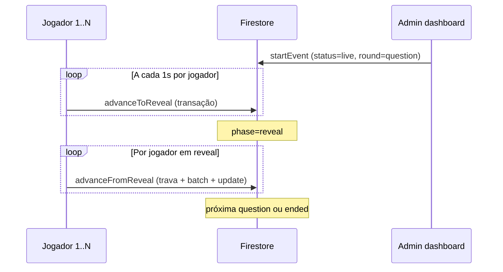

# Live Events — Análise do controle de rodadas e migração segura

**Data:** 2026-05-19  
**Escopo:** Sistema `live_events` exclusivamente — **sem alteração de código**.

---

## 1. Visão geral do fluxo atual

O modo implementado é **Último Sobrevivente** (`LiveEventType.ultimoSobrevivente`). O estado do jogo vive principalmente em um único documento:

`live_events/{eventId}`

com subcoleção de jogadores:

`live_events/{eventId}/participants/{userId}`

### Máquina de estados (rodada)

```
lobby → question → reveal → (processamento) → question → … → ended
         ↑__________________|
```

| Fase (`LiveRoundPhase`) | Comportamento na UI do jogador |
|-------------------------|--------------------------------|
| `lobby` | Aguardando / preparando |
| `question` | Exibe questão; timer local até `currentRound.endsAt` |
| `reveal` | Mostra gabarito; após ~4s chama próxima rodada |
| `ended` | Ranking final |

Campos críticos no documento do evento:

- `status` — `scheduled` | `upcoming` | `live` | `ended` | `cancelled`
- `currentRound` — `{ index, phase, question, startedAt, endsAt, correctCount, … }`
- `revealProcessedIndex` — trava de processamento pós-revelação (não exposto no modelo Dart, mas usado no Firestore)
- `usedQuestionIds`, `survivorCount`, `eliminatedCount`, `participantCount`

---

## 2. Quem pode avançar rodadas hoje

### 2.1 Jogadores (`LiveEventPlayPage`) — **motor principal em produção**

Qualquer aluno com a tela de jogo aberta:

| Ação | Gatilho | Frequência |
|------|---------|------------|
| `advanceToReveal` | `Timer.periodic(1s)` → `_onTick()` | **1 vez por segundo por dispositivo** |
| `advanceFromReveal` | Ao detectar `phase == reveal` → `_afterReveal()` após 4s | 1 vez por rodada por dispositivo (tentativas) |

Trecho relevante (`live_event_play_page.dart`):

- `initState`: `_uiTimer = Timer.periodic(const Duration(seconds: 1), (_) => _onTick());`
- `_onTick()` chama `_service.advanceToReveal(widget.eventId)` **sem verificar se é host/admin**
- Quando o stream mostra `reveal`, dispara `_afterReveal()` → `advanceFromReveal`

**Conclusão:** com *N* jogadores conectados, há até **N tentativas/segundo** de `advanceToReveal` durante a fase `question` (após `endsAt`), e **até N competidores** para `advanceFromReveal` na fase `reveal` (mitigado parcialmente por `revealProcessedIndex`).

### 2.2 Administrador (`AdminLiveEventDashboardPage`)

Admin autenticado (via `AdminPage` → `AdminGate`, não há gate extra na dashboard):

| Botão | Método |
|-------|--------|
| Iniciar evento | `startEvent` |
| Forçar revelação | `advanceToReveal` |
| Próxima rodada | `advanceFromReveal` |
| Finalizar | `endEvent` |
| Cancelar | `cancelEvent` |

O admin **não** executa timer automático; só ações manuais.

### 2.3 Outros pontos de escrita (mesmo serviço)

| Método | Quem típico | Altera evento? |
|--------|-------------|----------------|
| `createEvent` | Admin (form) | create |
| `joinEvent` | Jogador ao entrar | `participantCount` (+/- `survivorCount`) |
| `submitAnswer` | Jogador | só `participants/{uid}` |
| `endEvent` | `advanceFromReveal` ou admin | `status`, `currentRound`, rankings |
| `grantRewardsToUser` | fim do evento | `users/{uid}` (xp, badges) |

**Não existe** campo `hostId`, `coordinatorId` ou `createdBy` no `LiveEventModel` hoje.

---

## 3. Como funcionam `advanceToReveal` e `advanceFromReveal`

### 3.1 `advanceToReveal(eventId)`

**Objetivo:** quando o tempo da questão expira, mudar `currentRound.phase` de `question` → `reveal`.

**Implementação:** transação Firestore no doc `live_events/{eventId}`.

**Condições (todas devem passar):**

1. Documento existe  
2. `status == live`  
3. `currentRound.phase == question`  
4. `now >= endsAt - 500ms` (tolerância de meio segundo)

**Campos escritos:**

```text
currentRound: { ...round existente, phase: "reveal" }
updatedAt: serverTimestamp
```

**Idempotência:** se já está em `reveal`, retorna sem efeito. Múltiplos clientes competem; a transação serializa quem grava primeiro.

**Não altera** participantes neste passo.

---

### 3.2 `advanceFromReveal(eventId)`

**Objetivo:** após revelação, calcular acertos/eliminações, atualizar ranking parcial e iniciar próxima questão ou encerrar evento.

**Fase A — trava (transação):**

- Lê `live_events/{eventId}`
- Exige `status == live` e `phase == reveal`
- Lê `revealProcessedIndex`; se já igual a `currentRound.index`, **aborta** (evita processar a mesma rodada duas vezes)
- Caso contrário, grava `revealProcessedIndex = round.index`

**Fase B — processamento (fora da transação, múltiplas escritas):**

1. `get()` em todos os `participants`  
2. `batch.update` em cada participante ativo:
   - acerto → incrementa `correctAnswers`, `totalResponseTimeMs`, `score`
   - erro / não respondeu → eliminação ou perda de vida (`_eliminateOrLifeBatch`)
3. Reconta sobreviventes / eliminados  
4. Se `survivors <= 1` → `endEvent` (atualiza evento + `_finalizeRankings` + XP em `users`)  
5. Senão → `_sortearQuestao`, depois `update` no evento com nova `currentRound` (`question`, nova questão, novo `endsAt`, contadores da rodada anterior)

**Campos escritos no evento (rodada seguinte):**

```text
usedQuestionIds, currentRound, survivorCount, eliminatedCount, updatedAt
```

**Campos escritos em participantes:** status, vidas, scores, flags de resposta, etc.

**Observação:** a lógica de negócio (eliminação, sorteio, pontuação) roda **no cliente** de quem ganhou a trava — hoje, potencialmente qualquer jogador na fase `reveal`.

---

## 4. Documentos Firestore alterados

| Coleção / doc | Operações nos avanços de rodada | Quem dispara hoje |
|---------------|--------------------------------|-------------------|
| `live_events/{id}` | `update` / transação | Todos os jogadores + admin |
| `live_events/{id}/participants/*` | `batch.update` em `advanceFromReveal` | Cliente que processou reveal |
| `questoes` | `read` (sorteio próxima questão) | Mesmo cliente |
| `users/{uid}` | `set` merge (XP) em `endEvent` | Mesmo cliente |

**Leituras em massa:** `advanceFromReveal` faz `get()` na subcoleção inteira de participantes a cada rodada processada.

---

## 5. Regras de segurança atuais (`firestore.rules`)

```text
match /live_events/{eventId} {
  allow read: if isSignedIn();
  allow create, delete: if isAdmin();
  allow update: if isSignedIn();   // ← qualquer usuário logado

  match /participants/{participantId} {
    allow read: if isSignedIn();
    allow create: if isOwner(participantId) || isAdmin();
    allow update: if isSignedIn();   // ← qualquer usuário logado
    allow delete: if isAdmin();
  }
}
```

### O que as rules permitem na prática

| Ação maliciosa | Permitida? |
|----------------|------------|
| Jogador A altera `currentRound` / `status` do evento | **Sim** (`update` aberto) |
| Jogador A chama `endEvent` / `cancelEvent` via SDK | **Sim** |
| Jogador A edita documento de participante de B | **Sim** (`participants` update aberto) |
| Jogador ler evento e participantes | **Sim** (esperado) |
| Criar / apagar evento | **Não** (só `isAdmin`) |

As regras **não distinguem** campos sensíveis (`status`, `currentRound`) de campos “seguros” (`participantCount` em join). O app confia no cliente para só escrever o correto — **security by obscurity**.

---

## 6. Riscos atuais

### 6.1 Segurança e trapaça

| Risco | Severidade | Descrição |
|-------|------------|-----------|
| Manipulação do estado do evento | **Alta** | Qualquer conta pode pular fases, mudar questão, encerrar ou cancelar evento |
| Manipulação de participantes | **Alta** | Update aberto em `participants/{id}` |
| Motor de rodadas no cliente | **Alta** | Quem processa `advanceFromReveal` controla eliminações e sorteio |
| Sem coordenador designado | **Média** | Nenhum `hostId`; não há autoridade única |

### 6.2 Integridade e corrida

| Risco | Severidade | Descrição |
|-------|------------|-----------|
| Corrida em `advanceToReveal` | Baixa–Média | Transação ajuda; custo de tentativas repetidas |
| Corrida em `advanceFromReveal` | **Média** | `revealProcessedIndex` reduz duplicata; lógica pós-transação não é atômica com batch |
| Falha entre trava e batch | **Média** | Se crash após trava e antes do batch, rodada pode “travar” até admin intervir |

### 6.3 Custo e escala

| Risco | Severidade | Descrição |
|-------|------------|-----------|
| Writes O(N) por segundo | **Alta** | N jogadores × 1 Hz em `advanceToReveal` |
| Leitura full participants | **Média** | A cada rodada processada |
| Sorteio de questões no cliente | **Média** | Até 200 reads em `questoes` por rodada |

### 6.4 Produto / operação

| Risco | Severidade | Descrição |
|-------|------------|-----------|
| Dependência de todos os clientes | **Média** | Se ninguém estiver na tela, rodada não avança após `endsAt` |
| Admin manual como backup | Baixa | Dashboard existe, mas não é o fluxo normal |
| `LiveEventNotificationService` | Baixa | Stub; sem FCM para lembrar início |

---

## 7. Diagrama do fluxo atual



---

## 8. Comparativo das três alternativas de migração

### Alternativa 1 — Host único controlando o evento

**Modelo:** ao `startEvent`, gravar `hostId` (ex.: admin que iniciou ou primeiro moderador). Apenas `request.auth.uid == hostId` (ou `isAppAdmin`) pode atualizar `status`, `currentRound`, `revealProcessedIndex`, contadores globais. Jogadores só escrevem em `participants/{ownUid}`.

| Critério | Avaliação |
|----------|-----------|
| **Complexidade** | **Média (M)** — 3–5 dias: campo `hostId`, rules field-level, refatorar `LiveEventPlayPage` (timer só no host ou removido), opcional UI “sou moderador” |
| **Segurança** | **Alta** se rules restringirem updates do doc pai; elimina N escritores |
| **Custo Firestore** | **Baixo** — 1 cliente faz reveal + process (vs N/s) |
| **Escalabilidade** | **Boa** para 100–1000 jogadores (leituras via snapshots permanecem) |
| **Impacto no código** | `live_event_models.dart`, `live_event_service.dart`, `live_event_play_page.dart`, `firestore.rules`, `createEvent`/`startEvent`, admin dashboard (definir host) |

**Prós:** menor mudança arquitetural que Cloud Functions; UX automática preservada se o host mantiver app aberto.  
**Contras:** evento trava se host cair; precisa transferência de host ou fallback admin.  
**Mitigação:** `isAppAdmin` sempre pode assumir; ou `backupHostIds[]`.

---

### Alternativa 2 — Dashboard administrativo controlando o evento

**Modelo:** remover `advanceToReveal` / `advanceFromReveal` de `LiveEventPlayPage`. Jogadores só leem estado e enviam respostas (`submitAnswer`). Transições só via `AdminLiveEventDashboardPage` (ou app moderador dedicado).

| Critério | Avaliação |
|----------|-----------|
| **Complexidade** | **Média–Alta (M–L)** — 4–7 dias: rules fechadas + redesign UX; **ainda falta** quem dispara transição no tempo |
| **Segurança** | **Alta** para o doc do evento se `update` só `isAppAdmin` |
| **Custo Firestore** | **Muito baixo** em writes de rodada |
| **Escalabilidade** | **Operacional limitada** — humano precisa acompanhar cada evento |
| **Impacto no código** | Grande em `live_event_play_page.dart` (timer vira só UI); dashboard ganha automação ou integração com alt. 1/3 |

**Prós:** controle total humano; bom para pilotos / transmissões ao vivo com MC.  
**Contras:** **não escala**; sem automação, `endsAt` é decorativo; pior experiência se admin atrasar revelação.  
**Conclusão:** viável como **modo híbrido** (admin override + outro mecanismo para tempo real), raramente sozinha.

---

### Alternativa 3 — Cloud Functions controlando o evento

**Modelo:** mover `advanceToReveal`, `advanceFromReveal`, `startEvent` (opcional), `endEvent` para Functions (scheduled, callable ou trigger em `endsAt`). Cliente: `joinEvent`, `submitAnswer`, streams read-only no evento.

| Critério | Avaliação |
|----------|-----------|
| **Complexidade** | **Alta (L–XL)** — 1–2 semanas: projeto `functions/`, portar lógica Dart → TS, agendamento por `endsAt`, idempotência, testes, deploy CI |
| **Segurança** | **Muito alta** — Admin SDK ignora rules; surface de ataque mínima no cliente |
| **Custo** | **Médio** — invocações por rodada + Firestore no backend; sem N× writes de clientes |
| **Escalabilidade** | **Excelente** — milhares de participantes; processamento centralizado |
| **Impacto no código** | Novo pacote `functions/`; `LiveEventService` vira façade (callable + listeners); rules: `live_events` update **negado** para clientes |

**Opções de implementação:**

| Submodelo | Mecanismo |
|-----------|-----------|
| **3a Scheduled** | Cloud Scheduler + doc `scheduledTasks` ou Tasks API em `endsAt` |
| **3b Callable** | `httpsCallable('advanceRound')` só admin/host |
| **3c Firestore trigger** | Anti-pattern para timer exato; não recomendado sozinho |

**Prós:** arquitetura correta para pagamentos futuros e anti-cheat.  
**Contras:** maior esforço inicial; cold start; debugging distribuído.

---

## 9. Tabela comparativa resumida

| Critério | 1. Host único | 2. Só dashboard admin | 3. Cloud Functions |
|----------|:------------:|:---------------------:|:------------------:|
| Complexidade | M | M–L | L–XL |
| Segurança | Alta | Alta (evento) | Muito alta |
| Custo Firestore | Baixo | Muito baixo | Médio |
| Escalabilidade | Boa | Fraca (operação) | Excelente |
| UX tempo real | Boa* | Fraca | Boa |
| Impacto código app | Médio | Alto (play page) | Médio + novo backend |
| Dependência offline host | Sim | Sim (humano) | Não |

\*Desde que o host mantenha o app ativo.

---

## 10. Ordem de migração recomendada (sem implementar)

Objetivo: **não quebrar** eventos em andamento.

| Fase | Entrega | Itens P0 relacionados |
|------|---------|------------------------|
| **A** | Rules intermediárias + `participants` só owner | Fecha maior brecha imediata |
| **B** | Introduzir `hostId` + host-only updates no evento (alt. 1) | S2/S4 parcial, remove N-writes |
| **C** | Play page: timer local só UI; host (ou admin) único escritor de rodada | R2 implícito, V2 N/A aqui |
| **D** | (Opcional) Portar motor para Functions (alt. 3) | Estado final mais robusto |

**Não recomendado:** aplicar só rules restritivas (`update: isAdmin`) **sem** mover o motor — jogadores perderiam avanço automático e eventos travariam.

---

## 11. Arquivos que seriam alterados (por alternativa)

### Comum a todas

| Arquivo | Motivo |
|---------|--------|
| `firestore.rules` | Restringir `live_events` e `participants` |
| `lib/services/live_event_service.dart` | Quem pode chamar o quê |
| `lib/screens/live_events/live_event_play_page.dart` | Remover ou condicionar timer |
| `lib/models/live_event_models.dart` | `hostId`, opcional `revealProcessedIndex` no modelo |

### Alternativa 1 (host)

| Arquivo adicional |
|-------------------|
| `lib/screens/admin/admin_live_event_dashboard_page.dart` |
| `lib/services/live_event_service.dart` (`startEvent` define host) |

### Alternativa 2 (dashboard)

| Arquivo adicional |
|-------------------|
| `admin_live_event_dashboard_page.dart` (automação/timer) |
| Remoção de lógica de avanço em `live_event_play_page.dart` |

### Alternativa 3 (Functions)

| Arquivo adicional |
|-------------------|
| `functions/src/live_events/*.ts` (novo) |
| `firebase.json` |
| `lib/services/live_event_service.dart` (callables) |
| Documentação deploy |

---

## 12. Recomendação técnica

Para **migração segura sem quebrar o app atual**:

1. **Curto prazo (1 sprint):** Alternativa **1 (host único)** + endurecer rules de `participants` (só `request.auth.uid == participantId`).  
   - Admin que clica “Iniciar evento” vira `hostId`.  
   - `LiveEventPlayPage` deixa de chamar `advance*` para não-host.  
   - Dashboard admin mantém override (`isAppAdmin`).

2. **Médio prazo:** Evoluir para **Alternativa 3** copiando a lógica já validada em Dart para uma Function `processRound`, com agendamento em `endsAt` — elimina dependência do host online.

3. **Alternativa 2** apenas como **modo manual / emergência** (botões já existem no dashboard), não como motor principal.

---

## 13. Critérios de aceite pós-migração

- [ ] Cliente comum **não** consegue `update` em `live_events/{id}` (teste com rules simulator)  
- [ ] Cliente comum **não** consegue `update` em `participants/{outroUid}`  
- [ ] Rodada avança automaticamente no tempo com **≤ 1 escritor** por transição  
- [ ] Evento com 50+ jogadores não gera writes proporcionais a N por segundo  
- [ ] Admin pode iniciar, forçar revelação e encerrar sem regressão  
- [ ] `submitAnswer` continua funcionando para o dono do participante  

---

*Documento de análise — nenhuma implementação realizada.*
