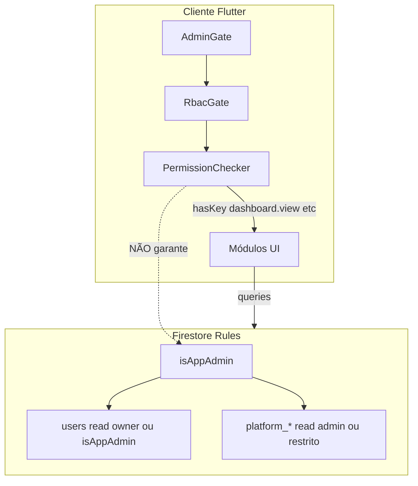

# Auditoria `permission-denied` — Painel Mestre da Plataforma

**Data:** 2026-05-19  
**Modo:** Somente leitura — **nenhum código alterado**  
**Escopo:** `MasterAdminShell` e os 11 módulos em `lib/screens/master_admin/`

---

## Resumo executivo

| Diagnóstico | Probabilidade |
|-------------|---------------|
| **Desalinhamento RBAC (cliente) × Firestore (`isAppAdmin`)** | **Alta** — o app libera o painel via permissões RBAC em memória, mas a maioria dos módulos exige `isAppAdmin()` nas rules |
| **S1 — query em `users` sem ser dono** | **Alta** — Dashboard + Usuários fazem agregação/listagem cross-user |
| **Rules `platform_*` não publicadas no Firebase** | **Alta** se **todos** os módulos falham, inclusive Vendedores/Afiliados (que só exigem `isSignedIn`) |
| **Ausência de role/permissão RBAC no cliente** | **Baixa** se o usuário consegue **entrar** no shell (menu visível) — nesse caso o `RbacGate` já passou |
| **Falha de seed RBAC** | **Média** — impede gravar catálogo, **não** impede leitura; `RbacService` usa fallback estático |

**Conclusão:** O Painel Mestre tem **duas camadas de autorização independentes**:

1. **Cliente** — `AdminGate` + `RbacGate` + `PermissionChecker` (roles/permissões em memória).
2. **Firestore** — quase sempre `isAppAdmin()` para dados administrativos.

Um administrador pode **passar no RBAC** e ainda receber `FirebaseError: permission-denied` em **todos** os módulos que leem Firestore se **não satisfizer `isAppAdmin()`** no servidor — ou se as rules/indexes não estiverem publicadas.

---

## 1. Usuário autenticado (como verificar)

### 1.1 Fonte no código

| Etapa | Arquivo | O que usa |
|-------|---------|-----------|
| Entrada Admin | `admin_page.dart` | `AdminGate` → `AdminAccessService.resolveAdminAccess` |
| Entrada Painel Mestre | `rbac_guard.dart` | `RbacService.resolveContext()` |
| Shell | `master_admin_shell.dart` | `FirebaseAuth.instance.currentUser` + `resolveContext()` |
| Configurações | `master_admin_settings_page.dart` | Exibe `ctx.userId`, papéis e contagem de permissões |

### 1.2 Identidade esperada

O usuário autenticado é sempre **`FirebaseAuth.instance.currentUser`**:

- **UID** — passado implicitamente em todas as requisições Firestore (`request.auth.uid` nas rules).
- **E-mail** — usado para `isFounder()` (`marciohgmm@gmail.com`).

### 1.3 Checklist de verificação (Console / app)

Execute **no dispositivo onde o erro ocorre** (Configurações do Painel Mestre mostra UID e papéis):

```text
[ ] Firebase Auth → Users → confirmar UID logado
[ ] Firestore → users/{uid} → campos isAdmin, rbacRoles, email
[ ] Firestore → admins/{uid} → documento existe?
[ ] Firestore → Rules → publicadas = firestore.rules do repositório?
[ ] Firestore → Request monitor → filtrar permission-denied → anotar path exato
```

**Critério Firestore para admin de plataforma (`isAppAdmin`):**

```javascript
isFounder()
|| exists(admins/{auth.uid})
|| (exists(users/{auth.uid}) && users.isAdmin == true)
```

Sem **nenhuma** dessas três condições, as rules **negam** Dashboard, Usuários, Assinaturas, Parceiros, Propagandas (lista completa), Auditoria e agregados em `users`.

---

## 2. Roles RBAC do usuário (resolução no cliente)

### 2.1 Fluxo `RbacService.resolveContext()`

```
loadCatalog()
  → read platform_rbac_roles / platform_rbac_permissions (isSignedIn)
  → ensureDefaultSeed() [write — só isAppAdmin; falha silenciosa → fallback]

get users/{uid}
  → isListedInAdmins = founder || exists(admins/{uid})
  → ensureRbacRolesPersisted() [grava rbacRoles se admin legado e lista vazia]

PermissionChecker.fromUserDoc()
  → roles + grantedPermissionKeys
```

### 2.2 Como os papéis são inferidos

| Condição | Papel efetivo (`AppRole`) |
|----------|---------------------------|
| E-mail founder | `masterAdmin` |
| `users.rbacRoles` não vazio | papéis do documento |
| Senão, `users.roles` (legado) | papéis legados |
| Senão, `listedInAdmins \|\| users.isAdmin` | `admin` |
| Caso contrário | `user` |

### 2.3 Papéis persistidos automaticamente

`AdminLegacyCompat.ensureRbacRolesPersisted` grava `rbacRoles` **somente se**:

- lista atual vazia, **e**
- usuário é founder, listado em `admins`, ou `isAdmin == true`.

Aluno comum **não** recebe escrita de `rbacRoles`.

---

## 3. Permissões efetivas (`PermissionChecker`)

### 3.1 Regras de concessão

```dart
// permission_checker.dart
if (ctx.isFounder) return true;  // qualquer permissionKey
if (ctx.grantedPermissionKeys.contains(key)) return true;
```

`grantedPermissionKeys` = união de:

- permissões dos papéis no **catálogo Firestore** (`RbacCatalog.permissionsForRoles`), ou
- fallback **`RolePermissionMatrix.defaults`** se catálogo vazio/inacessível,
- `users.extraPermissions` (se existir),
- **founder** → todas as chaves do catálogo.

### 3.2 Permissões exigidas por módulo

| Módulo | `AppPermission` | Chave |
|--------|-----------------|-------|
| Dashboard | `dashboardView` | `dashboard.view` |
| Usuários | `userManage` | `user.manage` |
| Assinaturas / Planos | `subscriptionManage` | `subscription.manage` |
| Vendedores | `sellerManage` | `seller.manage` |
| Afiliados | `affiliateManage` | `affiliate.manage` |
| Cupons | `couponManage` | `coupon.manage` |
| Parceiros | `partnershipManage` | `partnership.manage` |
| Propagandas | `adManage` | `ad.manage` |
| Auditoria | `auditRead` | `audit.read` |
| Configurações | `platformSettings` | `platform.settings` |

### 3.3 Papéis → permissões (fallback estático)

| Papel | Painel Mestre |
|-------|---------------|
| `masterAdmin` | **Todas** (inclui os 11 módulos) |
| `admin` | **Todas** exceto `rbac.manage` explícito no matrix — inclui dashboard, users, audit, etc. |
| `seller` / `affiliate` | só `dashboard.view` + `content.read` |
| `user` | só `content.read` — **não** deveria ver módulos |

### 3.4 `canAccessAdminPanel` (entrada na área admin)

Verdadeiro se: founder, legacy admin (`listedInAdmins \|\| isAdmin flag`), papel `admin`/`masterAdmin`, ou chave `admin.panel.access`.

**Importante:** `canAccessAdminPanel == true` **não implica** `isAppAdmin()` no Firestore.

---

## 4. Coleções Firestore por módulo

### 4.1 Mapa completo

| Módulo | Arquivo | Método / stream | Coleção(ões) | Operação |
|--------|---------|-----------------|--------------|----------|
| **Dashboard** | `master_admin_dashboard_page.dart` | `loadSnapshot()` | ver §4.2 | get / count |
| **Usuários** | `master_admin_users_page.dart` | `build` | `users` | snapshots query limit 100 |
| **Assinaturas** | `master_admin_subscriptions_page.dart` | `build` | `platform_subscriptions` | snapshots limit 80 |
| **Planos** | `master_admin_plans_page.dart` | `watchActivePlans()` | `platform_subscription_plans` | snapshots where `isActive` |
| **Vendedores** | `master_admin_sellers_page.dart` | `watchAll(activeOnly: false)` | `platform_sellers` | snapshots (todos) |
| **Afiliados** | `master_admin_affiliates_page.dart` | `watchAll(activeOnly: false)` | `platform_affiliates` | snapshots (todos) |
| **Cupons** | `master_admin_coupons_page.dart` | `watchActive()` | `platform_coupons` | snapshots where `isActive` |
| **Parceiros** | `master_admin_partners_page.dart` | `watchAll()` | `platform_partnerships` | snapshots (todos) |
| **Propagandas** | `master_admin_ads_page.dart` | `build` | `platform_advertisements` | snapshots limit 50 |
| **Auditoria** | `master_admin_audit_page.dart` | `watchRecent()` | `platform_audit_logs` | snapshots orderBy limit |
| **Configurações** | `master_admin_settings_page.dart` | `resolveContext` / botão reload | `users/{uid}`, `platform_rbac_*` | get; seed write opcional |

**Shell (abertura):** `platform_audit_logs` create (auditoria abertura — `create: isSignedIn`).

### 4.2 Dashboard — detalhe `_AdminDashboardRepo.loadSnapshot()`

| # | Consulta | Coleção | `_safeCount`? | Falha aborta load? |
|---|----------|---------|---------------|-------------------|
| 1 | `count()` | `users` | **Não** | **Sim** |
| 2 | count where `updatedAt` ≥ 30d | `users` | Sim → 0 | Não |
| 3 | count where `createdAt` ≥ 30d | `users` | Sim → 0 | Não |
| 4 | `count()` | `admins` | **Não** | **Sim** |
| 5 | count where `isAdmin == true` | `users` | Sim → 0 | Não |
| 6–7 | count sellers/affiliates ativos | `platform_sellers`, `platform_affiliates` | Sim | Não |
| 8 | `count()` | `platform_subscriptions` | **Não** | **Sim** |
| 9–10 | count by status | `platform_subscriptions` | Sim | Não |
| 11 | count pending | `platform_payments` | Sim | Não |
| 12 | count active coupons | `platform_coupons` | Sim | Não |
| 13 | get limit 8 | `platform_audit_logs` | **Não** | **Sim** |
| 14 | receita projetada | `platform_subscriptions` + `platform_subscription_plans` | try/catch → 0 | Não |

➡️ A **primeira** query que exige `isAppAdmin()` e falha derruba o Dashboard inteiro (`Erro ao carregar: FirebaseError...`).

---

## 5. Regra Firestore que nega — módulo a módulo

### 5.1 Funções críticas (rules)

```javascript
isAppAdmin() = isFounder() || exists(admins/auth.uid)
            || (exists(users/auth.uid) && users.isAdmin == true)

// S1 — users
read users/{userId}: isOwner(userId) || isAppAdmin()

// admins
read admins/{adminId}: isSignedIn() && (auth.uid == adminId || isAdmin())
// isAdmin() = founder || exists(admins/auth.uid)  ← NÃO inclui users.isAdmin sozinho
```

### 5.2 Matriz módulo × rule × quem passa

| Módulo | Rule principal | Passa com `isAppAdmin()` | Passa só `isSignedIn()` (aluno) | Observação |
|--------|----------------|--------------------------|----------------------------------|------------|
| Dashboard | `users` L98, `admins` L89, `platform_*` | Sim* | **Não** | *`admins.count()` falha se só `users.isAdmin` sem doc em `admins/` |
| Usuários | `users` L98 | Sim | **Não** | Query `users.limit(100)` viola S1 |
| Assinaturas | `platform_subscriptions` L425 | Sim | **Não** | Query sem filtro `userId` |
| Planos | `platform_subscription_plans` L419–420 | Sim (todos) | **Sim** (só `isActive`) | Deveria funcionar para qualquer logado |
| Vendedores | `platform_sellers` L439 | Sim | **Sim** | `read: isPlatformCatalogReader()` |
| Afiliados | `platform_affiliates` L444 | Sim | **Sim** | Idem |
| Cupons | `platform_coupons` L449–450 | Sim (todos) | **Sim** (só ativos) | Query filtra `isActive` |
| Parceiros | `platform_partnerships` L455 | Sim | **Não** | `read: isAppAdmin()` only |
| Propagandas | `platform_advertisements` L460–461 | Sim | **Não** | Query sem filtro `isActive` |
| Auditoria | `platform_audit_logs` L466 | Sim | **Não** | |
| Configurações | `users/{uid}` L98; RBAC L487–493 | read próprio OK | read RBAC OK | UI não lista erros Firestore; seed write nega não-admin |

### 5.3 Padrão de sintomas

| Sintomas observados | Causa mais provável |
|---------------------|---------------------|
| **Todos** os 11 módulos com `permission-denied` | Rules `platform_*` **não deployadas** (default deny) **ou** sessão Firestore sem auth |
| Dashboard, Usuários, Assinaturas, Parceiros, Ads, Audit falham; **Vendedores/Afiliados/Planos/Cupons OK** | Usuário **não é `isAppAdmin()`** no Firestore |
| Só **Usuários** + **Dashboard** (métricas users) | S1 — esperado para não-admin |
| Entra no painel mas **Configurações** “ok”, resto falha | RBAC cliente OK; Firestore admin não |

---

## 6. Classificação da causa raiz

### 6.1 Ausência de role RBAC (cliente)

| Cenário | Efeito |
|---------|--------|
| Usuário com papel `user` | `MasterAdminShell._visible` vazio → mensagem *“Sua conta não possui permissões…”* — **não** chega a abrir módulos |
| Usuário `admin` / founder no cliente | Menu completo visível; **Firestore pode negar** independentemente |

**Veredito:** Se o usuário **vê** os 11 módulos e navega entre eles, **não** é ausência de role no RBAC cliente.

### 6.2 Ausência de permissão RBAC (cliente)

`RbacGate` bloqueia com tela *“Acesso negado”* (UI Flutter) — **não** exibe `FirebaseError`.

Se a mensagem é literalmente `FirebaseError: permission-denied`, a falha é **Firestore**, não `PermissionChecker`.

### 6.3 Falha de seed RBAC

| Operação | Rule | Efeito |
|----------|------|--------|
| `ensureDefaultSeed()` batch create | `platform_rbac_*` create → `isAppAdmin()` | Falha para não-admin se coleções vazias |
| Tratamento | `RbacService.loadCatalog` catch → `RbacCatalog.fallback()` | Permissões **continuam** via matrix estática |

**Veredito:** Seed falho **não explica** denial nos módulos de dados; no máximo impede persistir catálogo no Firestore.

### 6.4 Regra Firestore (principal)

| Coleção | Motivo do bloqueio |
|---------|-------------------|
| `users` (query/count) | S1: leitura cross-user só `isAppAdmin()` |
| `platform_subscriptions` (lista admin) | Rule exige dono ou admin; query administra todos |
| `platform_partnerships`, `platform_audit_logs` | `read: isAppAdmin()` |
| `platform_advertisements` (sem filtro) | Pode retornar docs inativos → query rejeitada para não-admin |
| `admins` (count total) | `isAdmin()` não inclui flag `users.isAdmin` isolada |

### 6.5 Inconsistência RBAC × firestore.rules

| Camada | Critério de “admin” |
|--------|---------------------|
| **Cliente** `canAccessAdminPanel` / papéis | founder, `admins/{uid}`, `users.isAdmin`, `rbacRoles` com matrix fallback |
| **Firestore** `isAppAdmin()` | founder, `admins/{uid}`, `users.isAdmin` — **ignora `rbacRoles`** |
| **Firestore** `isAdmin()` (admins read, flashcards write) | founder, `admins/{uid}` — **ignora `users.isAdmin`** |

**Casos problemáticos documentados:**

1. **`rbacRoles: ['admin']` sem `admins/` e sem `isAdmin`** → cliente libera; Firestore nega tudo admin.
2. **`users.isAdmin == true` sem `admins/`** → `isAppAdmin()` true para `users`, mas **`admins.count()` no Dashboard falha**.
3. **Founder** → bypass total cliente + `isFounder()` rules (deve funcionar se e-mail token correto).

---

## 7. Diagrama — duas camadas



---

## 8. Plano de correção mínimo (não implementado)

Prioridade sugerida:

### P0 — Operacional (sem código)

1. Confirmar no Firebase Console que **`firestore.rules` do repo está publicado**.
2. Para o UID que falha, verificar **triplete admin**:
   - `admins/{uid}` existe **ou**
   - `users/{uid}.isAdmin == true` **ou**
   - e-mail founder.
3. No **Request monitor**, capturar **primeira** path negada ao abrir Dashboard.

### P1 — Dados (sem código)

| Problema | Ação |
|----------|------|
| Admin legado sem triplete | Criar `admins/{uid}` via fluxo `grantAdmin` **ou** set `isAdmin: true` em `users/{uid}` |
| Founder sem bypass | Verificar e-mail verificado no Auth token |

### P2 — Código (quando autorizado)

| Item | Correção mínima |
|------|-----------------|
| Inconsistência RBAC/Firestore | Alinhar `isAdmin()` → `isAppAdmin()` em `admins` read e rules legadas (D5) |
| Dashboard frágil | Envolver **todas** as counts em `_safeCount` **ou** exigir `isAppAdmin` antes de `loadSnapshot` |
| Usuários S1 | Query com guard explícito; alternativa Cloud Function agregadora |
| Propagandas | Filtrar `where('isActive', true)` como Cupons |
| Assinaturas admin | Query só após check `isAppAdmin` ou filtro server-side |
| Seed RBAC | Mover `ensureDefaultSeed` para script deploy admin-only |

### P3 — UX

- Diferenciar na UI: *“Sem permissão RBAC”* (RbacGate) vs *“Sem permissão Firestore — conta não é isAppAdmin”* (StreamBuilder error).

---

## 9. Procedimento de diagnóstico para o usuário afetado

Copie da tela **Configurações** do Painel Mestre:

```text
UID: ___________________
Papéis: _________________
Permissões (count): ______
```

No Firestore:

```text
users/{UID}.isAdmin = ?
users/{UID}.rbacRoles = ?
admins/{UID} exists = ?
Auth email = ?
```

Abra **Dashboard** e anote a **primeira** linha negada no monitor:

| Path | Operação | Esperado se corrigido |
|------|----------|------------------------|
| `users` count | read | allow com isAppAdmin |
| `admins` count | read | allow com isAdmin() ou ajuste rule |
| `platform_subscriptions` count | read | allow com isAppAdmin |

---

## 10. Referências de código

| Componente | Caminho |
|------------|---------|
| Shell + bootstrap | `lib/screens/master_admin/master_admin_shell.dart` |
| Destinos / permissões | `lib/screens/master_admin/master_admin_destinations.dart` |
| Dashboard repo | `lib/infrastructure/firestore/platform/firestore_platform_repositories.dart` (`_AdminDashboardRepo`) |
| RBAC resolve | `lib/application/rbac/rbac_service.dart` |
| PermissionChecker | `lib/core/permissions/permission_checker.dart` |
| Rules plataforma + S1 | `firestore.rules` L96–104, L88–90, L418–494 |

---

**Fim do relatório — nenhuma alteração de código foi aplicada.**
