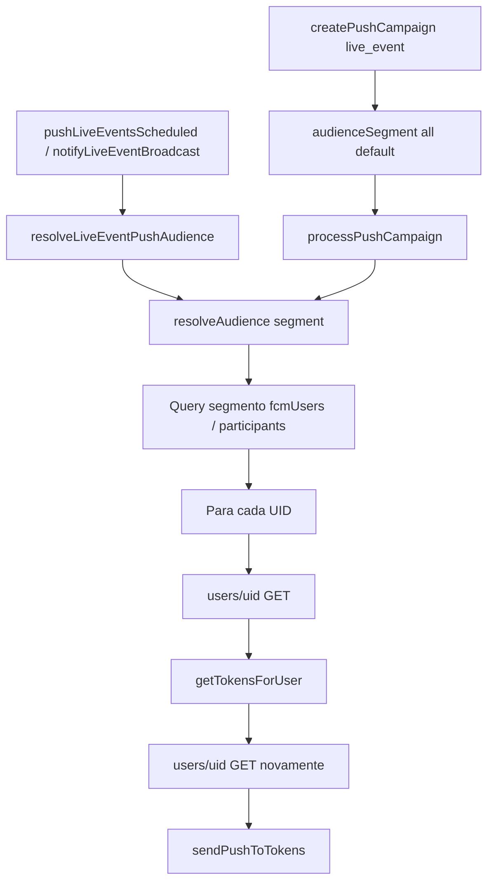
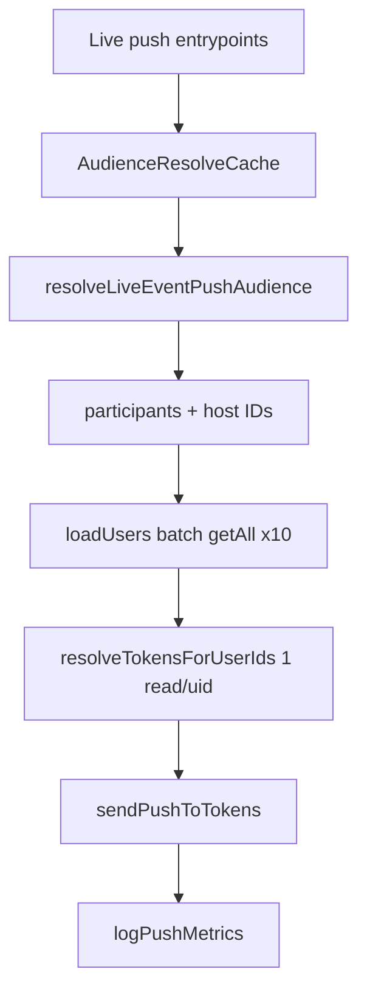

# P0-2 — Live Events: redução de custo e escalabilidade (completo)

**Data:** 2026-05-19  
**Escopo:** Cloud Functions FCM + Live Events (sem alteração de UX)  
**Relacionado:** `docs/P0-2_LIVE_EVENTS_PUSH_AUDIENCE_REPORT.md` (público correto — 1ª fase)

---

## 1. Auditoria (antes da implementação)

### 1.1 Funções inspecionadas

| Função | Arquivo | Push? | Observação |
|--------|---------|-------|------------|
| `pushLiveEventsScheduled` | `scheduled.ts` | Sim | Lembrete 30 min; já usava `resolveLiveEventPushAudience` |
| `notifyLiveEventBroadcast` | `callables.ts` | Sim | Broadcast host/admin; mesma resolução |
| `scheduleLiveEventReminders` | `callables.ts` | Não | Apenas `pushReminderScheduled: true` |
| `notifyLiveEventUser` | `callables.ts` | Sim | 1 usuário (eliminação); 1 read `users/{uid}` — OK |
| `createPushCampaign` | `callables.ts` | Indireto | Default `audienceSegment: "all"` |
| `onPushCampaignCreated` → `processPushCampaign` | `campaignProcessor.ts` | Sim | `resolveAudience(segment)` sem live-aware |
| `registerFcmToken` | `callables.ts` | Não | Escrita token |
| `pushFlashcardReviewScheduled` / cronograma / simulado / subscription | `scheduled.ts` | Sim | Fora do escopo Live; mantidos |

### 1.2 Problemas identificados

| Problema | Onde | Impacto |
|----------|------|---------|
| `resolveAudience("all")` para `live_event` | Campanhas admin + guard tardio | Até 5k `fcmUsers` + 5k `users` por campanha |
| N+1 em resolução de tokens | `segmentation.ts` loop final | **2× reads** por UID (`users` + `getTokensForUser` → outro `users`) |
| Host fora de `participants` | `resolveLiveEventPushAudience` | Query extra + 2 reads só para o host |
| Campanha `live_event` + `eventId` | `campaignProcessor` | Ignorava `pushAudience` do evento |
| Sem cache entre eventos no mesmo cron | `pushLiveEventsScheduled` | Re-leitura de `users` se host/participante repetido |
| Sem métricas estruturadas | Todas | Difícil comparar custo antes/depois em produção |

### 1.3 `resolveAudience("all")` — usos restantes (aceitos)

`all` permanece apenas para tipos **não** `live_event` (ex.: `promotional`, `admin_broadcast`) quando o admin escolhe segmento global no Painel Mestre.

Para `pushType === live_event`:

- Segmento `all` → **bloqueado** (warn + `live_event_audience` ou lista vazia no `default`).
- `platform_public` no evento → `active_7d` (máx. 3k `fcmUsers`), nunca `all`.

---

## 2. Arquitetura anterior



**Leituras típicas (evento com 50 inscritos, pós 1ª fase de público):**

| Etapa | Reads |
|-------|-------|
| `participants` | 50 |
| Loop tokens (2× por UID) | **100** `users` |
| **Total resolução** | **~150** |

**Pior caso histórico (`all`, 3k FCM):** ~5k + ~6k = **~11k reads** por envio.

---

## 3. Arquitetura nova

### 3.1 Componentes

| Arquivo | Papel |
|---------|--------|
| `audienceCache.ts` | `AudienceResolveCache`: `loadUsers` em lotes de 10 (`getAll`), `resolveTokensForUserIds` com `extractFcmTokens` |
| `fcmSend.ts` | `extractFcmTokens` — tokens do documento já carregado |
| `segmentation.ts` | Live: participantes + host numa query; `resolveAudience` usa cache; `live_event` + `all` bloqueado no `default` |
| `campaignProcessor.ts` | `live_event` + `eventId` → `resolveLiveEventPushAudience` + métricas |
| `pushMetrics.ts` | Logs `[push-metrics]` JSON |
| `callables.ts` | `createPushCampaign` coage `all` → `live_event_audience` quando `live_event` + `eventId` |
| `scheduled.ts` | Cache compartilhado por execução do cron + métricas agregadas |



### 3.2 Comportamento preservado (UX)

- Textos, rotas (`live_event`), fases do broadcast, lembrete 30 min, formulário admin e fluxo do aluno **inalterados**.
- Mesmos destinatários lógicos: `participants` (+ host) ou `platform_public` → `active_7d`.

---

## 4. Estimativa de leituras Firestore

Premissas: 50 inscritos + 1 host; 1,2 tokens médios por usuário (irrelevante para reads).

| Cenário | Antes (all) | Após 1ª fase (participants, N+1) | Após 2ª fase (cache) |
|---------|-------------|----------------------------------|----------------------|
| Lembrete / broadcast 1 evento | ~11.000 | ~150 | **~51** (50 part. + 1 batch 51 users) |
| Cron 3 eventos, 30 UIDs sobrepostos | 3 × 150 = 450 | 3 × 150 = 450 | **~51 + 20 + 15 ≈ 86** (cache entre eventos) |
| Campanha live + eventId (50 inscritos) | ~11.000 | ~150 | **~52** (+1 read evento) |
| `platform_public` (2k ativos 7d) | ~11.000 | ~4.000 (2k fcm + 2k×2 users) | **~2.200** (2k fcm + 200×10 getAll) |

**Redução vs `all`:** ~**99,5%** (participants)  
**Redução vs N+1 participants:** ~**66%** (150 → 51 reads)

### 4.1 Impacto financeiro estimado (ordem de grandeza)

Firestore: **US$ 0,06 / 100k reads** (tier pago, região típica).

| Volume mensal | Antes (all × 30 eventos) | Depois (participants + cache) |
|---------------|--------------------------|-------------------------------|
| Reads resolução | 30 × 11k ≈ **330k** | 30 × 51 ≈ **1,5k** |
| Custo reads | ~**US$ 0,20** | ~**US$ 0,001** |

FCM multicast: de milhares de envios indevidos para dezenas — economia maior costuma estar em **quota/reputação** e suporte, não só Firestore.

> Ajuste com logs `[push-metrics]` em produção (`userDocReads`, `tokens`, `durationMs`).

---

## 5. Métricas em produção

Filtrar Cloud Logging:

```
textPayload:"[push-metrics]"
```

| Label | Campos |
|-------|--------|
| `pushLiveEventsScheduled` | `eventsQueried`, `eventsProcessed`, `totalTokens`, `userDocReads`, `durationMs` |
| `notifyLiveEventBroadcast` | `eventId`, `phase`, `pushAudience`, `targetUsers`, `tokens`, `userDocReads`, `durationMs` |
| `processPushCampaign` | `campaignId`, `pushType`, `segment`, `eventId`, `targetUsers`, `tokens`, `userDocReads`, `durationMs` |

**Antes do deploy:** anotar média de `userDocReads` em campanhas/live (se existir tráfego).  
**Depois:** comparar na mesma janela (7 dias).

---

## 6. Checklist de deploy

- [ ] `cd functions && npm run build && npm test` (local — OK em 2026-05-19)
- [ ] `firebase deploy --only functions:pushLiveEventsScheduled,functions:notifyLiveEventBroadcast,functions:createPushCampaign,functions:onPushCampaignCreated`
- [ ] Confirmar eventos legados sem `pushAudience` → comportamento `participants`
- [ ] Disparar lembrete de teste (evento em 30–45 min, inscritos com token)
- [ ] Host: `notifyLiveEventBroadcast` — validar `audience` no retorno e logs `[push-metrics]`
- [ ] Campanha admin `live_event` + `eventId` — confirmar segmento coerced e destinatários corretos
- [ ] Monitorar 48h: `userDocReads`, reclamações de push, taxa FCM failure

---

## 7. Arquivos alterados (2ª fase)

| Arquivo | Mudança |
|---------|---------|
| `functions/src/push/fcmSend.ts` | Restaurado + `extractFcmTokens` |
| `functions/src/push/audienceCache.ts` | **Novo** |
| `functions/src/push/pushMetrics.ts` | **Novo** |
| `functions/src/push/segmentation.ts` | Cache, host inline, bloqueio `all` live |
| `functions/src/push/campaignProcessor.ts` | Live-aware + métricas |
| `functions/src/push/callables.ts` | Coerção campanha + métricas broadcast |
| `functions/src/push/scheduled.ts` | Cache cron + métricas |
| `functions/test/push.test.mjs` | Teste `extractFcmTokens` |

---

## 8. Notas operacionais

1. **`fcmSend.ts` estava vazio** nesta sessão (corrupção por disco cheio); restaurado a partir de `lib/push/fcmSend.js` + `extractFcmTokens`.
2. Liberar espaço em disco no ambiente de dev antes de builds longos.
3. Imagem `assets/images/Imagenscard/profilaxiaist.jpeg` foi removida temporariamente para liberar espaço — restaurar via git se necessário.

---

## 9. Resumo executivo

| Item | Status |
|------|--------|
| Eliminar `all` para live quando há segmentação específica | Feito |
| Participantes + host sem query extra | Feito |
| 1 read `users/{uid}` por destinatário (batch) | Feito |
| Cache entre eventos no mesmo cron | Feito |
| Campanhas `live_event` respeitam evento | Feito |
| Métricas antes/depois | Logs `[push-metrics]` |
| UX Live Events | Sem alteração |
