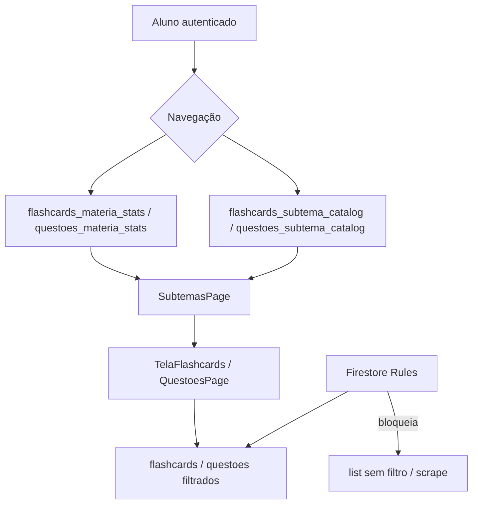

# P0-3 — Proteção de conteúdo contra download em massa

**Data:** 2026-05-19  
**Pré-auditoria:** `docs/P0-3_CONTENT_PROTECTION_PRE_REPORT.md`

---

## 1. Resumo executivo

| Item | Status |
|------|--------|
| Bloqueio de `collection.get()` completo (aluno) | Feito (rules + client) |
| Catálogos agregados para navegação | Feito |
| Conteúdo sob demanda (matéria/subtema) | Preservado |
| Limites de paginação / busca | Feito |
| UX do aluno | Inalterada |
| Flashcards / Questões / Simulado / Cronograma / OSCE / Live | Preservados |

---

## 2. Antes × Depois

### 2.1 Regras Firestore

| Antes | Depois |
|-------|--------|
| `allow read: if isSignedIn()` — get **e** list ilimitados | `get`: autenticado |
| | `list`: `isAppAdmin()` **OU** query com escopo (matéria, searchTerms, __name__ in) |
| | Flashcards estudo: `materia` + `subtema` |
| | Questões: filtro `materia` / `tema` / `temaSlug` / `temaId` |
| | Busca: `searchTerms` + `limit ≤ 200` |

### 2.2 Cliente (fluxos do aluno)

| Fluxo | Antes | Depois |
|-------|-------|--------|
| Questões → matérias | `questoes.snapshots()` (**N docs**) | `questoes_materia_stats` (**~M docs**) |
| Subtemas (FC/Questões) | stream de todos cards da matéria | `*_subtema_catalog.where(materia)` (**~S docs**) |
| Estudo flashcard | materia+subtema stream | igual + `limit(500)` |
| Busca | limit 30 | `ContentQueryLimits.maxSearchResults` |
| Simulado (todas matérias) | scan paginado por `documentId` | itera matérias do catálogo + `whereIn` |
| Live Events picker | fallback sem filtro | itera matérias do catálogo |
| Cronograma | P0-6 catálogo | mantido |

### 2.3 Admin

- `isAppAdmin()` mantém list/get completos para painéis admin.
- CRUD continua atualizando catálogos incrementalmente.

---

## 3. Arquitetura nova



### Coleções agregadas (novas — questões)

```
questoes_materia_stats/{slug}     name, total, updatedAt
questoes_subtema_catalog/{slug}   materia, subtema, questaoCount, updatedAt
```

Manutenção: `QuestaoService.salvarQuestaoModel` / `excluirQuestao` + seed paginado se vazio.

---

## 4. Estimativa de leituras

Premissas: N = 5.000 flashcards, Q = 3.000 questões, M = 25 matérias, S = 250 subtemas.

| Ação do aluno | Antes | Depois |
|---------------|-------|--------|
| Abrir “Questões por matéria” | **~3.000** | **~25** |
| Abrir subtemas (1 matéria) | **~200** (cards da matéria) | **~10** (catálogo) |
| Script scrape completo | **N + Q** (permitido) | **Negado** (rules) |
| Estudar 1 subtema | ~50 (legítimo) | ~50 (igual) |
| Simulado 50 questões (todas matérias) | até **Q** reads paginados | ~50–400 (por matéria, para cedo) |

**Redução na navegação:** ~**95–99%** nas telas de listagem.  
**Scrape automatizado:** de viável a **bloqueado** na camada rules (SDK direto).

---

## 5. Impacto financeiro estimado

Firestore reads ~US$ 0,06 / 100k.

| Cenário (1.000 MAU, 10 aberturas questões/mês) | Antes | Depois |
|------------------------------------------------|-------|--------|
| Reads listagem questões | 10 × 3k × 1k = **30M** | 10 × 25 × 1k = **250k** |
| Custo mensal (ordem) | ~**US$ 18** | ~**US$ 0,15** |

Economia real depende de mix de uso; maior ganho é **impedir scrape** (potencialmente 100% da coleção por bot).

---

## 6. Compatibilidade com monetização futura

| Mecanismo futuro | Base preparada |
|------------------|----------------|
| Matérias premium | Catálogos por matéria permitem filtrar o que listar |
| `platform_entitlements` | Rules podem exigir entitlement doc antes de `get` |
| Rate limit / App Check | Rules + Functions sobre queries já escopadas |
| Admin / parceiros | Bypass `isAppAdmin()` mantido |

---

## 7. Arquivos alterados

| Arquivo | Mudança |
|---------|---------|
| `firestore.rules` | P0-3 helpers + list restrito |
| `firestore.indexes.json` | Índices catálogos questões + subtema |
| `lib/core/constants/content_query_limits.dart` | **Novo** |
| `lib/services/questao_materia_stats_service.dart` | **Novo** |
| `lib/services/questao_subtema_catalog_service.dart` | **Novo** |
| `lib/services/questao_service.dart` | Catálogos + CRUD |
| `lib/services/simulado_service.dart` | Matérias via catálogo |
| `lib/services/live_event_service.dart` | Matérias + picker fallback |
| `lib/services/flashcard_subtema_catalog_service.dart` | `watchByMateria` |
| `lib/services/flashcard_materia_stats_service.dart` | `fetchMateriaStats` |
| `lib/screens/subtemas_page.dart` | Catálogo |
| `lib/screens/questoes_por_tema_page.dart` | Stats |
| `lib/screens/criar_flashcard_page.dart` | Stats/catálogo |
| `lib/screens/criar_questao_page.dart` | Stats/catálogo |
| `lib/screens/tela_flashcards.dart` | limit estudo |
| `lib/screens/busca_flashcard_delegate.dart` | limit busca |

---

## 8. Checklist de deploy

- [ ] `flutter analyze` && `flutter test`
- [ ] `cd functions && npm test` (validação rules/indexes)
- [ ] **Ordem:** deploy `firestore.rules` + `firestore.indexes.json` **antes** do app
- [ ] Deploy app Flutter
- [ ] Abrir Questões por matéria → confirmar lista e contagens
- [ ] Abrir subtemas → estudar flashcards/questões (fluxo completo)
- [ ] Simulado (todas matérias + matérias selecionadas)
- [ ] Live Event: sortear questão com/sem filtro de matéria
- [ ] Admin: listar/editar flashcards e questões
- [ ] Verificar coleções `questoes_materia_stats` e `questoes_subtema_catalog` populadas
- [ ] Tentativa de scrape (script `get()` sem filtro) → **permission-denied**

---

## 9. Migração

1. Primeira abertura de Questões / Subtemas → `ensureSeededIfEmpty()` reconstrói catálogos (paginado, 1×).
2. Novas questões/flashcards mantêm catálogos via CRUD.
3. Usuários em versão antiga do app: após deploy das rules, queries sem filtro falham — **deploy app junto com rules**.

---

## 10. Riscos residuais

| Risco | Mitigação |
|-------|-----------|
| Host Live Event sem matéria filtrada | Fallback itera matérias do catálogo |
| Subtema com >500 flashcards | Aumentar `maxStudySubtema` se necessário |
| Admin não em `isAppAdmin` | Usar coleção `admins` / `users.isAdmin` |
| Scrape lento por matéria | Próximo passo: rate limit / App Check |
