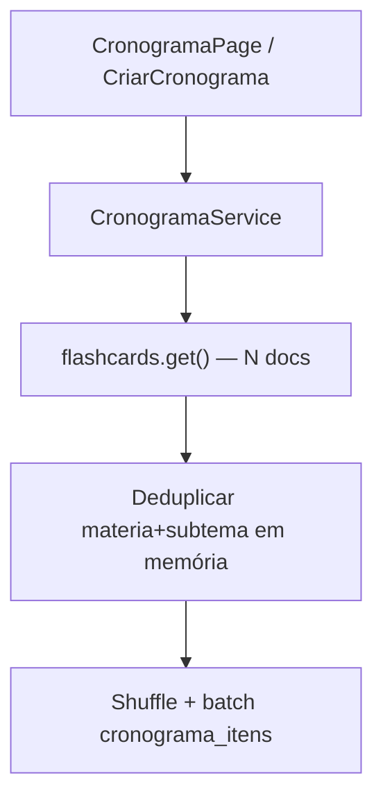
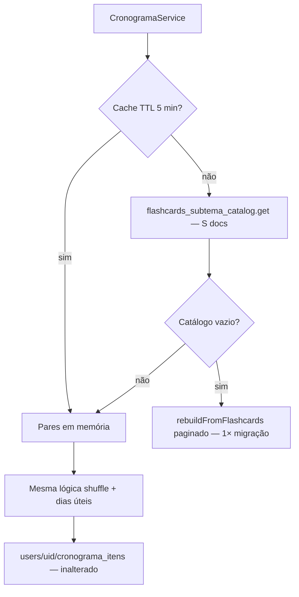

# P0-6 — Cronograma: redução de custo e escalabilidade

**Data:** 2026-05-19  
**Escopo:** `CronogramaService`, catálogo agregado, manutenção no CRUD de flashcards  
**Objetivo:** eliminar `collection('flashcards').get()` na criação/sincronização de cronogramas.

---

## 1. Auditoria (antes da implementação)

### 1.1 Pontos mapeados

| # | Local | Método / fluxo | Problema |
|---|-------|----------------|----------|
| 1 | `lib/services/cronograma_service.dart` | `_batchCriarCronograma()` | `flashcards.get()` — lê **N** documentos para extrair pares únicos matéria/subtema |
| 2 | `lib/services/cronograma_service.dart` | `sincronizarSubtemas()` | Idem — executado ao abrir `CronogramaPage` |
| 3 | `lib/screens/cronograma_page.dart` | `FutureBuilder` → `sincronizarSubtemas` | Dispara full scan a cada visita |
| 4 | `lib/screens/criar_cronograma_page.dart` | `criarCronogramaInicial` → `_batchCriarCronograma` | Full scan na criação |
| 5 | `lib/services/firebase_service.dart` | CRUD flashcards | Não mantinha catálogo de subtemas (só `flashcards_materia_stats` por matéria) |

### 1.2 O que o cronograma realmente precisa

A lógica pedagógica usa apenas **pares únicos `(materia, subtema)`**, não o conteúdo de cada card:

- deduplicação por `ContentHierarchyUtils.subtemaPairKey`
- shuffle aleatório
- 1 subtema novo por dia útil
- sync: adiciona apenas pares **ausentes** no cronograma existente

Ler **N flashcards** para obter **S subtemas** (S ≪ N) é custo O(N) desnecessário.

### 1.3 Impacto anterior

| Operação | Reads Firestore (N = 5.000 cards, S = 250 subtemas) |
|----------|-----------------------------------------------------|
| Criar cronograma | **~5.000** |
| Abrir cronograma (sync) | **~5.000** + reads dos itens do usuário |
| Usuário abre 20×/mês | **~100.000** reads só em sync |

---

## 2. Arquitetura anterior



- Sem cache entre chamadas
- Mesma coleção raoteada na Home (P0-1) e no cronograma
- Escala linearmente com total de flashcards

---

## 3. Arquitetura nova

### 3.1 Coleção agregada

```
flashcards_subtema_catalog/{slug}
  materia: string
  subtema: string
  cardCount: number
  updatedAt: timestamp
```

- **~S documentos** (pares únicos), não N cards
- ID estável: `ContentHierarchyUtils.subtemaCatalogDocId(materia, subtema)`
- Mantida incrementalmente no CRUD (`FirebaseService`) + rebuild paginado na importação

### 3.2 Serviços

| Componente | Função |
|------------|--------|
| `FlashcardSubtemaCatalogService` | Leitura do catálogo, cache TTL 5 min, `ensureSeededIfEmpty()`, rebuild paginado |
| `CronogramaService` | `_carregarSubtemasDoCatalogo()` substitui `flashcards.get()` |
| `FirebaseService` | `registerCard` / `unregisterCard` no catálogo em create/update/delete/import |

### 3.3 Fluxo



### 3.4 Garantias preservadas

| Requisito | Status |
|-----------|--------|
| UX do cronograma | Inalterada |
| Lógica pedagógica (1/dia útil, shuffle, revisões) | Inalterada |
| Cronogramas já existentes | **Não modificados** — sync só **adiciona** faltantes |
| Ordem/datas de itens existentes | Preservadas |

---

## 4. Estimativa de leituras Firestore

Premissas: N = 5.000 flashcards, S = 250 subtemas, usuário com 250 itens de cronograma.

| Operação | Antes | Depois |
|----------|-------|--------|
| Criar cronograma | ~5.000 | **~250** (catálogo) ou **~251** (probe + seed se vazio) |
| Sync ao abrir (1ª vez / cache frio) | ~5.000 | **~250** + ~250 itens usuário |
| Sync (cache quente, < 5 min) | ~5.000 | **0** catálogo + ~250 itens usuário |
| Seed inicial (catálogo vazio, 1×) | — | ~5.000 paginado (400/página) — **não repetido** |

**Redução típica por abertura do cronograma:** ~**95%** (5.000 → 250)  
**Com cache em memória na mesma sessão:** ~**100%** no catálogo (0 reads extras)

### 4.1 Impacto financeiro estimado

Firestore reads: ~US$ 0,06 / 100k (tier pago).

| Cenário mensal (1 usuário, 20 aberturas) | Antes | Depois |
|------------------------------------------|-------|--------|
| Reads sync | 100.000 | ~5.000 (cache reduz mais) |
| Custo reads | ~US$ 0,06 | ~US$ 0,003 |

Com **1.000 usuários ativos** no cronograma: ~US$ 60/mês → ~**US$ 3/mês** só na resolução de subtemas (ordem de grandeza).

---

## 5. Migração / seed

1. Na **primeira** operação de cronograma (ou CRUD) se `flashcards_subtema_catalog` estiver vazio → `ensureSeededIfEmpty()` executa rebuild paginado (mesmo padrão P0-1).
2. Novos cards mantêm o catálogo via `registerCard` / `unregisterCard`.
3. Importação JSON em massa chama `rebuildFromFlashcards()` no catálogo.

**Cronogramas existentes:** documentos em `users/{uid}/cronograma_itens` **não são alterados** retroativamente.

---

## 6. Checklist de deploy

- [ ] `flutter analyze` e `flutter test` (local)
- [ ] Deploy `firestore.rules` (coleção `flashcards_subtema_catalog`)
- [ ] Deploy app (Flutter) — **sem** deploy de Functions obrigatório
- [ ] Após deploy: abrir cronograma como usuário teste → verificar coleção `flashcards_subtema_catalog` populada (~S docs)
- [ ] Criar novo flashcard (admin) → confirmar entrada/incremento no catálogo
- [ ] Sync: adicionar subtema novo → deve aparecer no cronograma com mesma regra de dias úteis
- [ ] Validar que itens/datas de cronogramas antigos permanecem iguais

---

## 7. Arquivos alterados

| Arquivo | Mudança |
|---------|---------|
| `lib/services/cronograma_service.dart` | Catálogo em vez de `flashcards.get()` |
| `lib/services/flashcard_subtema_catalog_service.dart` | **Novo** |
| `lib/models/flashcard_subtema_catalog_entry.dart` | **Novo** |
| `lib/core/constants/firestore_paths.dart` | Path `flashcards_subtema_catalog` |
| `lib/utils/content_hierarchy_utils.dart` | `subtemaCatalogDocId()` |
| `lib/services/firebase_service.dart` | Manutenção incremental do catálogo |
| `firestore.rules` | Regras da nova coleção |
| `test/services/flashcard_subtema_catalog_service_test.dart` | **Novo** |

---

## 8. Resumo executivo

| Item | Status |
|------|--------|
| Eliminar `flashcards.get()` no cronograma | Feito |
| Usar agregação (`flashcards_subtema_catalog`) | Feito |
| Cache de catálogo (TTL 5 min) | Feito |
| Rebuild paginado (seed/migração) | Feito |
| UX / lógica pedagógica / cronogramas existentes | Preservados |
