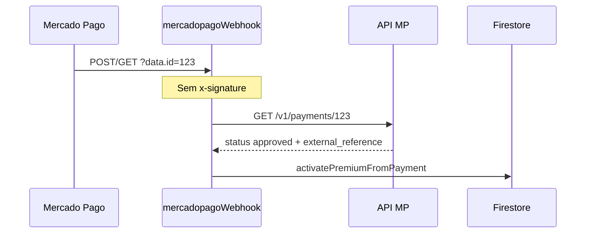

# Pré-relatório — P0-B Segurança webhook Mercado Pago

**Data:** 2026-05-19  
**Modo:** Auditoria somente leitura (pré-correção)  
**Referência:** `docs/LGPD_SECURITY_AUDIT.md` (S-P0-02 / C-P0-01)

---

## 1. Componentes auditados

| Componente | Arquivo | Função |
|------------|---------|--------|
| Webhook HTTP | `functions/src/webhook.ts` | IPN `mercadopagoWebhook` |
| Checkout | `functions/src/createCheckout.ts` | Cria preferência + `platform_payments` pending |
| Ativação | `functions/src/subscriptionService.ts` | `activatePremiumFromPayment` |
| Processador | `functions/src/subscription/paymentProcessor.ts` | Idempotência + status MP |
| Reconciliação | `functions/src/subscription/paymentReconciliation.ts` | Scheduled + callable |
| Cliente MP | `functions/src/subscription/mercadoPagoPaymentClient.ts` | GET payment / search |

---

## 2. Perguntas obrigatórias

### Assinatura `x-signature` está sendo validada?

**Não.** `mercadopagoWebhook` não lê `x-signature`, `x-request-id` nem secret do painel de integrações.

```20:56:functions/src/webhook.ts
      const paymentIdFromQuery =
        (req.query["data.id"] as string) ??
        (req.query.id as string) ??
        req.body?.data?.id;
      // ...
      const outcome = await processMercadoPagoPaymentById(
        accessToken,
        String(paymentIdFromQuery),
        "webhook"
      );
```

### Existe replay attack?

**Parcialmente mitigado, não eliminado.**

- Atacante pode **reenviar** o mesmo IPN com `payment id` válido → `processMercadoPagoPaymentById` é idempotente (não duplica entitlement de forma óbvia).
- Sem validação de `ts` no header, replay **fora da janela** não é rejeitado.
- IPN falso com ID de pagamento de **terceiro** (se adivinhado) dispara consulta à API MP — resultado depende do ID.

### Existe spoofing?

**Sim.** Qualquer cliente HTTP pode chamar a URL pública do webhook com `?data.id=<mp_payment_id>` sem provar origem Mercado Pago.

Mitigação atual: após receber o ID, o servidor **consulta a API MP** (`fetchMercadoPagoPayment`) — não confia no body para `status`, mas **confia que o evento veio do MP** apenas pelo fato de processar o ID.

### Existe bypass?

| Vetor | Estado |
|-------|--------|
| Falsificar `approved` no body | **Mitigado** — status vem da API MP |
| Disparar ativação com ID alheio sem pagamento local | **Parcial** — retorna `not_found` se `external_reference` não existir em `platform_payments` |
| Flood / DoS no endpoint | **Aberto** — sem rate limit |
| Ignorar webhook e usar reconciliação | Callable autenticada — não substitui spoof anônimo no webhook |

### Existe trust excessivo no payload recebido?

| Dado | Confiança atual |
|------|-----------------|
| `status` / valor | **Baixa** — re-fetch na API (correto) |
| `payment id` na query | **Alta** — aceito sem autenticar origem (**incorreto**) |
| `topic` / `type` | Usado só para filtrar — OK |
| Body JSON | Quase não usado para decisão financeira — OK |

---

## 3. Fluxo atual (resumo)



---

## 4. Reconciliação (não substitui autenticação do webhook)

| Mecanismo | Auth | Fonte de verdade |
|-----------|------|------------------|
| `reconcileMercadoPagoPaymentsScheduled` | Admin SDK + secret MP | API MP |
| `reconcileMyMercadoPagoPayments` | Firebase Auth callable | API MP |
| App polling pós-checkout | Auth | API MP |

Não expõem o mesmo vetor anônimo do webhook público.

---

## 5. Logs de auditoria

- `subscriptionService` grava `platform_audit_logs` em `payment.succeeded` (Admin SDK).
- **Não** há registro estruturado de tentativas de webhook inválidas / assinatura rejeitada.

---

## 6. Conclusão pré-correção

| Item | Status |
|------|--------|
| `x-signature` | **Ausente** — P0 |
| `x-request-id` no manifest | **Ausente** |
| Replay (`ts`) | **Ausente** |
| API MP como fonte de status | **Implementado** |
| Auditoria de falhas | **Ausente** |

**Correção planejada (Etapa 4):** HMAC-SHA256 oficial MP, secret `MERCADOPAGO_WEBHOOK_SECRET`, rejeição 401, audit em `platform_audit_logs`, manter fetch API antes de processar.

---

*Documento gerado na Etapa 3 — base para implementação e `docs/P0_SECURITY_FIXES_REPORT.md`.*
