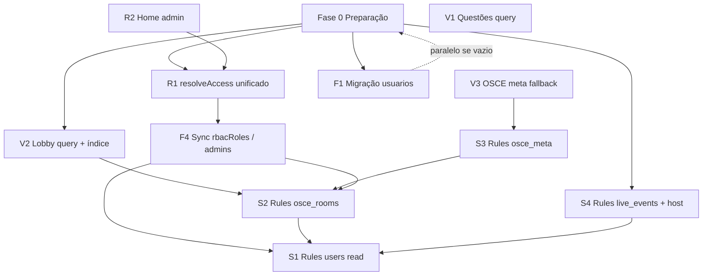

# Plano de migração P0 — Trilha Med

**Data:** 2026-05-19  
**Escopo:** Itens P0 da auditoria (`docs/TECHNICAL_AUDIT.md`)  
**Restrição:** Este documento é **somente planejamento** — nenhuma alteração de código foi feita.

---

## Itens P0 no escopo

| ID | Tema |
|----|------|
| F1 | Coexistência `users` vs `usuarios` |
| F4 | Múltiplos sistemas de admin |
| S1 | `users` legível por qualquer autenticado |
| S2 | `osce_rooms` update/delete abertos |
| S3 | `osce_meta` write aberto |
| S4 | `live_events` update aberto |
| R1 | Admin inconsistente (`resolveAccess` vs RBAC) |
| R2 | Home admin inconsistente |
| V1 | Questões — coleção inteira |
| V2 | Lobby OSCE — coleção inteira |
| V3 | Fallback OSCE — scan de todas as salas |

---

## Visão geral da estratégia

A migração segue o princípio **“app compatível → rules mais rígidas → dados consolidados”**:

1. **Preparação** sem breaking (inventário, backup, índices).
2. **Correções de cliente de baixo risco** que já reduzem custo/abuso (V3, V1, R2).
3. **Queries OSCE** (V2) + **índice** antes de endurecer rules OSCE.
4. **Rules OSCE** (S3, S2) alinhadas ao que o cliente realmente escreve.
5. **Admin unificado** (R1, F4) antes de restringir leitura de `users` para admins.
6. **Live events** (S4) — maior complexidade; exige redesign leve do “motor de rodadas”.
7. **Privacidade `users`** (S1) — por último entre P0, com modelo de perfil público.
8. **Migração `usuarios`** (F1) — paralela se vazia; senão após backup.

Não há Cloud Functions no repositório hoje; o plano prioriza **rules + cliente**. Onde isso for insuficiente (S4), o plano indica **fase 2 com Functions**.

---

## 1. Ordem ideal de correção

### Fase 0 — Preparação (0 breaking)

| Ordem | Item | Ação |
|-------|------|------|
| 0.1 | Todos | Export/backup Firestore (`users`, `usuarios`, `admins`, `osce_rooms`, `osce_meta`, `live_events`) |
| 0.2 | V2 | Criar índice composto `osce_rooms`: `status` + `createdAt` (ou `roomNumber`) em `firestore.indexes.json` |
| 0.3 | F1 | Script de inventário: contagem docs em `usuarios/**` vs `users/**/progresso` |
| 0.4 | F4 | Planilha de admins: união `admins`, `users.isAdmin`, `users.rbacRoles`, founder |
| 0.5 | S4 | Mapear todos os `update`/`set` em `live_events/{id}` no `LiveEventService` |

### Fase 1 — Quick wins no cliente (risco baixo)

| Ordem | Item | Ação |
|-------|------|------|
| 1.1 | **R2** | Home: abrir `AdminPage` direto (já tem `AdminGate`) ou chamar `RbacService.canAccessAdminPanel` |
| 1.2 | **V3** | Remover fallback `_roomsCol.get()`; retry/backoff na transação `osce_meta/counters` |
| 1.3 | **V1** | Substituir `getTodasQuestoes()` por query paginada/filtrada em telas admin |

### Fase 2 — Performance OSCE (pré-requisito de S2)

| Ordem | Item | Ação |
|-------|------|------|
| 2.1 | **V2** | `streamAllOpenRooms()` → query `where status in [waiting, selectingCase, ready, running, evaluating]` |
| 2.2 | — | Deploy índices + release app **antes** de S2 restritivo |

### Fase 3 — Rules OSCE (segurança estrutural)

| Ordem | Item | Ação |
|-------|------|------|
| 3.1 | **S3** | `osce_meta`: `allow write: if isAppAdmin()` (ou false + só Admin SDK) |
| 3.2 | **S2** | `osce_rooms`: update/delete por `hostId`, participante da sala, papéis evaluator/evaluated, `isAppAdmin` |

### Fase 4 — Admin unificado (app + dados)

| Ordem | Item | Ação |
|-------|------|------|
| 4.1 | **R1** | `AdminAuthService.resolveAccess` passa a delegar a `RbacService.canAccessAdminPanel` ou fachada única |
| 4.2 | **F4** | Script: para cada admin legado, gravar `rbacRoles: ['admin']`; manter `admins/{uid}` como índice |
| 4.3 | **F4** | `grantAdmin`/`revokeAdmin` atualizam `rbacRoles` + `admins` + `isAdmin` em uma transação |

### Fase 5 — Live events (motor de rodadas)

| Ordem | Item | Ação |
|-------|------|------|
| 5.1 | **S4** | Introduzir `hostId` / `coordinatorId` no evento (se ausente) |
| 5.2 | **S4** | Rules: transição `status` / `currentRound` só `isAppAdmin` **ou** `request.auth.uid == resource.data.hostId` |
| 5.3 | **S4** | Cliente: `advanceToReveal` / `advanceFromReveal` só no dashboard admin **ou** no cliente do host |
| 5.4 | **S4** | Participantes: continuam `update` apenas em `participants/{uid}` |

### Fase 6 — Privacidade users

| Ordem | Item | Ação |
|-------|------|------|
| 6.1 | **S1** | Criar `users/{uid}/public_profile/{uid}` ou campos públicos explícitos (`displayName`, `photoUrl`) |
| 6.2 | **S1** | Rules: `users` read = owner \| isAppAdmin; leitura pública via subcoleção |
| 6.3 | **S1** | Migrar leituras que precisam de nome alheio para `participants.displayName` (já usado em OSCE/live) |

### Fase 7 — Dados legados

| Ordem | Item | Ação |
|-------|------|------|
| 7.1 | **F1** | Se `usuarios` tiver dados: copiar → `users/{uid}/progresso` (merge, não delete) |
| 7.2 | **F1** | Remover `ProgressoService` / referências; deprecar rules `usuarios` (read/write negado após migração) |

---

## 2. Dependências entre correções

| Dependência | Motivo |
|-------------|--------|
| **V2 → S2** | Rules restritas não corrigem query; sem V2 o lobby continua caro. S2 pode bloquear updates que o app ainda faz como “qualquer user”. |
| **V3 → S3** | Após S3, fallback full scan não pode ser “solução”; V3 deve eliminar dependência do scan. |
| **R1 → F4** | Revogar/grant admin precisa de API única antes de confiar só em `rbacRoles`. |
| **R1/R2 → S1** | Painel mestre e admin precisam ler `users` via `isAppAdmin` nas rules. |
| **F4 → S1** | `isAdmin` e `rbacRoles` devem estar alinhados quando rules deixarem de expor `users`. |
| **S4 independente de F1** | Domínios separados. |
| **V1 independente** | Só admin; não bloqueia rules. |

**Podem ir em paralelo (após Fase 0):** R2 + V3 + V1  
**Devem ser sequenciais:** V2 → deploy índice → S2; R1 → F4 → S1

---

## 3. Riscos de cada alteração

| ID | Risco da alteração | Mitigação |
|----|-------------------|-----------|
| **F1** | Perda de progresso antigo em `usuarios` | Backup; merge idempotente; validar contagem antes/depois |
| **F4** | Admin perde acesso se script errar papéis | Manter founder bypass; dry-run; rollback de `rbacRoles` no backup |
| **S1** | OSCE/live quebram se algo lia `users` de terceiros | Auditoria de leituras (hoje: nomes vêm de `participants`, não de `users`) |
| **S2** | Salas travam (ninguém consegue iniciar/trocar papel) | Rules incrementais; testes com 2 contas; staging |
| **S3** | Criação de sala falha se meta bloqueada e transação falhar | V3 com retry; monitorar `osce_meta/counters` |
| **S4** | Evento ao vivo trava (rodadas não avançam) | Host único ou dashboard admin como coordenador; teste E2E |
| **R1** | Mudança de quem é admin | Lista branca pré-migração; logs de acesso |
| **R2** | Mais usuários veem botão admin (se critério ampliar) | Usar mesmo critério que `AdminGate`, não ampliar |
| **V1** | Telas admin de questões incompletas | Paginação + busca; manter filtros por matéria |
| **V2** | Lobby vazio se índice/status divergir | Alinhar enum `OsceRoomStatus` com valores no Firestore |
| **V3** | Falha ao criar sala sem fallback | Alertas; doc manual para resetar contador (admin) |

---

## 4. Estratégia de rollback

### 4.1 Firestore Security Rules

| Ação | Rollback |
|------|----------|
| Deploy rules novas | Firebase Console → Rules → histórico → **Publish previous version** (minutos) |
| Recomendação | Tag Git por deploy (`rules-YYYY-MM-DD`) + cópia local de `firestore.rules` |

### 4.2 Índices

| Ação | Rollback |
|------|----------|
| Novo índice composto | Índices antigos permanecem; remover do JSON impede novos deploys, não apaga índice existente |
| Query V2 sem índice | App falha com erro explícito — rollback de **app** ou deploy índice |

### 4.3 App (Flutter)

| Ação | Rollback |
|------|----------|
| Release store | Versão anterior na Play/App Store |
| Teste interno | Build anterior do CI |

### 4.4 Dados (F1, F4)

| Ação | Rollback |
|------|----------|
| Cópia `usuarios` → `users` | Manter `usuarios` intacto até validação; rollback = app volta a ler `usuarios` (não recomendado longo prazo) |
| Script `rbacRoles` | Restaurar campo do backup exportado |

### 4.5 Ordem de rollback em incidente

1. Reverter **rules** (mais rápido se app novo + rules antigas = incompatível, avaliar caso a caso)  
2. Reverter **app**  
3. Restaurar **dados** só se corrupção comprovada  

---

## 5. Impactos em usuários atuais

| ID | Alunos (estudo) | Admins | OSCE multiplayer | Live events |
|----|-----------------|--------|------------------|-------------|
| **F1** | Nenhum se `usuarios` vazio; senão progresso antigo pode aparecer após merge | Nenhum | Nenhum | Nenhum |
| **F4** | Nenhum | Quem só tinha `isAdmin` sem `admins` ganha consistência; revogação passa a funcionar em todos os canais | Nenhum | Nenhum |
| **S1** | Não leem mais perfil alheio (hoje regra permite, app quase não usa) | Painel mestre continua via `isAppAdmin` | Sem impacto se nomes vêm de `participants` | Sem impacto |
| **S2** | Nenhum se regras refletirem fluxo atual host/avaliador | Moderação via admin | **Possível interrupção** se rules mal especificadas | Nenhum |
| **S3** | Nenhum | Nenhum | Falha ao **criar sala** se contador quebrar | Nenhum |
| **S4** | Nenhum direto | Dashboard deve coordenar rodadas se regra exigir host | Nenhum | **Alto**: jogadores não podem mais “empurrar” rodada no doc do evento |
| **R1/R2** | Nenhum | Entrada admin previsível | Nenhum | Nenhum |
| **V1** | Nenhum | Lista de questões paginada (UX diferente) | Nenhum | Nenhum |
| **V2** | Lobby pode listar menos salas se filtro errado | Nenhum | Lobby mais rápido | Nenhum |
| **V3** | Nenhum | Nenhum | Criação de sala mais lenta ou falha sem retry | Nenhum |

**Janela recomendada:** Fases 3 e 5 em **horário de baixo uso**, com conta de teste founder + 2 alunos.

---

## 6. Arquivos previstos para alteração

### Por item P0

| ID | Arquivos (criar / alterar) |
|----|----------------------------|
| **F1** | `lib/services/progresso_service.dart` (remover ou redirecionar), `lib/core/constants/firestore_paths.dart`, `firestore.rules` (`match /usuarios`), script migração `tools/` ou doc operacional (novo) |
| **F4** | `lib/services/auth/admin_auth_service.dart`, `lib/application/rbac/rbac_service.dart`, `lib/core/permissions/permission_checker.dart`, script sync Firestore (novo), opcional `functions/` futuro |
| **S1** | `firestore.rules` (`match /users`), `lib/services/auth/user_profile_service.dart`, `lib/screens/perfil_page.dart`, `lib/screens/master_admin/modules/master_admin_users_page.dart`, modelo `public_profile` (novo, opcional) |
| **S2** | `firestore.rules` (`osce_rooms`, `participants`), `lib/services/osce/osce_room_service.dart`, testes manuais `lib/screens/osce/*` |
| **S3** | `firestore.rules` (`osce_meta`), `lib/services/osce/osce_room_service.dart` (`_allocateRoomNumber`) |
| **S4** | `firestore.rules` (`live_events`, `participants`), `lib/services/live_event_service.dart`, `lib/screens/live_events/live_event_play_page.dart`, `lib/screens/admin/admin_live_event_dashboard_page.dart`, `lib/models/live_event_models.dart` (hostId) |
| **R1** | `lib/services/auth/admin_auth_service.dart`, `lib/application/rbac/rbac_service.dart`, novo `lib/services/auth/admin_access_facade.dart` (opcional) |
| **R2** | `lib/screens/home_page.dart` |
| **V1** | `lib/services/questao_service.dart`, `lib/screens/editar_questoes_page.dart`, possivelmente `lib/screens/admin_questoes_lista_page.dart`, `lib/screens/admin_questoes_materias_page.dart` |
| **V2** | `lib/services/osce/osce_room_service.dart`, `lib/screens/osce/osce_lobby_page.dart`, `firestore.indexes.json` |
| **V3** | `lib/services/osce/osce_room_service.dart` |

### Arquivos transversais

| Arquivo | Motivo |
|---------|--------|
| `firestore.rules` | S1, S2, S3, S4, F1 |
| `firestore.indexes.json` | V2 (e validação pós-S1) |
| `docs/TECHNICAL_AUDIT.md` / `docs/RBAC.md` | Atualizar após migração |
| `docs/P0_MIGRATION_PLAN.md` | Checklist de execução |

**Não devem mudar na Fase 1–4 (objetivo explícito):** `lib/main.dart`, `lib/screens/login_page.dart`, fluxos principais de flashcards/questões para alunos.

---

## 7. Estimativa de complexidade

Escala: **S** (≤½ dia) · **M** (1–2 dias) · **L** (3–5 dias) · **XL** (1–2 semanas com testes)

| ID | Complexidade | Esforço resumido | Notas |
|----|--------------|------------------|-------|
| **R2** | **S** | 1–2 h | Só `home_page.dart` |
| **V3** | **S** | 2–4 h | Retry + remover fallback |
| **V1** | **M** | 1 d | 1 tela principal + serviço; admin_questoes_* já usam queries próprias |
| **V2** | **M** | 1–2 d | Query + índice + testes lobby |
| **S3** | **S** | 1–2 h | Rule + validar create room |
| **S2** | **L** | 3–4 d | Rules field-level + testes multiplayer completos |
| **S4** | **L–XL** | 4–8 d | Redesenho coordenador de rodadas; maior risco de regressão |
| **R1** | **M** | 1–2 d | Fachada + testes admin |
| **F4** | **M–L** | 2–3 d | Script dados + grant/revoke + RBAC seed |
| **S1** | **L** | 3–5 d | Modelo perfil + rules + auditoria de leituras |
| **F1** | **S–M** | 4 h–2 d | **S** se `usuarios` vazio; **M** se migração real |

### Pacotes sugeridos de release

| Release | Itens | Complexidade agregada | Risco usuário |
|---------|-------|----------------------|---------------|
| **R-A** “Quick” | R2, V3, V1 | ~2 d | Baixo |
| **R-B** “OSCE” | V2, S3, S2 | ~5 d | Médio (multiplayer) |
| **R-C** “Admin” | R1, F4 | ~3 d | Baixo (admins) |
| **R-D** “Live” | S4 | ~5–8 d | Alto (eventos) |
| **R-E** “Privacy + data” | S1, F1 | ~4–7 d | Baixo–médio |

**Total estimado:** ~15–25 dias úteis com testes em staging, ou ~8–12 dias se S4 for adiado para Cloud Functions (fase 2).

---

## 8. Critérios de aceite (por item)

| ID | Pronto quando… |
|----|----------------|
| F1 | Zero escritas em `usuarios`; progresso único em `users`; inventário documentado |
| F4 | `grantAdmin`/`revokeAdmin` sincronizam 3 fontes; founder intacto; Painel Mestre lista admins corretos |
| S1 | Usuário comum não lê `users/{outroUid}`; admin lê; app sem `permission-denied` nos fluxos críticos |
| S2 | Usuário B não altera sala de A; host/avaliador conseguem fluxo completo |
| S3 | Cliente não autenticado comum não altera `osce_meta`; criação de sala OK |
| S4 | Apenas host/admin altera `status`/`currentRound`; jogadores respondem só em `participants` |
| R1 | `resolveAccess` e `canAccessAdminPanel` retornam mesmo resultado para mesma conta |
| R2 | Gesto 4s e teste admin usam mesmo critério que `AdminPage` |
| V1 | Nenhum stream da coleção `questoes` inteira em produção |
| V2 | Lobby usa query filtrada; custo de leitura estável com 100+ salas |
| V3 | Nenhum `get()` full collection em `osce_rooms` |

---

## 9. Checklist operacional pré-go-live

- [ ] Backup Firestore do ambiente de produção  
- [ ] Ambiente de staging com cópia anonimizada  
- [ ] Contas de teste: founder, admin listado, admin só `isAdmin`, aluno A, aluno B  
- [ ] Deploy índice V2 **antes** do app V2  
- [ ] Deploy rules S3 **com** app V3  
- [ ] Deploy rules S2 **após** teste manual OSCE (criar, entrar, avaliar, sair)  
- [ ] Evento live de teste com 3+ participantes antes de S4 em produção  
- [ ] Monitorar erros `permission-denied` no Firebase console (24h pós-deploy)  

---

## 10. Recomendação executiva

1. Executar **R-A** imediatamente (baixo risco, ganho rápido).  
2. Tratar **OSCE (R-B)** como segundo marco — segurança + performance.  
3. Unificar **admin (R-C)** antes de fechar **privacidade (R-E)**.  
4. **Live events (R-D)** merece spike de ½ dia: se rules puras forem inviáveis, planejar **Cloud Function** `advanceRound` e manter S4 como P0 estendido sem bloquear R-A/R-B.

---

*Documento gerado para planejamento. Nenhum código ou rule foi modificado.*
