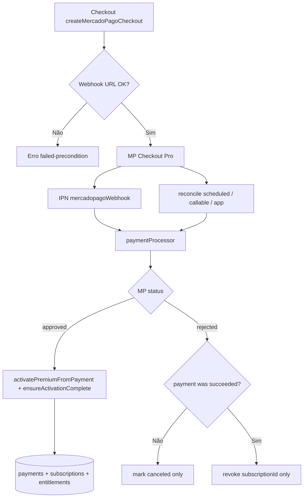

# Relatório — Correções P0 Assinatura Premium

**Data:** 2026-05-19  
**Referência:** `docs/PREMIUM_SUBSCRIPTION_AUDIT.md`  
**Prioridade aplicada:** segurança financeira e consistência entre `platform_payments`, `platform_subscriptions` e `platform_entitlements`.

---

## Resumo executivo

| ID | Problema | Status |
|----|----------|--------|
| **P0-1** | Checkout sem `notification_url` quando `MERCADOPAGO_WEBHOOK_URL` vazio | **Corrigido** |
| **P0-2** | Idempotência ignorava reparo de entitlement após `succeeded` parcial | **Corrigido** |
| **P0-3** | Pagamento recusado revogava todo Premium ativo | **Corrigido** |
| **P0-4** | Ativação dependia exclusivamente de um IPN transitório | **Mitigado** |

---

## Estratégia por P0 (revisão pré-implementação)

### P0-1 — Webhook URL obrigatória

**Antes:** `notification_url` opcional; checkout criado mesmo sem IPN.  
**Estratégia:** Falhar `createMercadoPagoCheckout` se `MERCADOPAGO_WEBHOOK_URL` e `MERCADOPAGO_ACCESS_TOKEN` não estiverem configurados; flag `MERCADOPAGO_ALLOW_CHECKOUT_WITHOUT_WEBHOOK=true` apenas para dev/emulador.  
**Depois:** Checkout bloqueado em produção sem URL; logs JSON `checkout.config_validation`.

### P0-2 — Idempotência com reparo

**Antes:** Webhook ignorava `activatePremiumFromPayment` se `status === succeeded`.  
**Estratégia:** `activatePremiumFromPayment` sempre garante tríade payment + subscription + entitlement via `ensureActivationComplete`; webhook sempre processa `approved`.  
**Depois:** Retries de IPN e reconciliação reativam entitlement ausente sem duplicar cupom/vendedor.

### P0-3 — Recusa não remove Premium válido

**Antes:** `deactivatePremiumEntitlementsForSubscription(userId, undefined)` desativava todos os `premium` ativos.  
**Estratégia:** `markPaymentRejected` só revoga se pagamento já foi `succeeded`; `deactivatePremiumEntitlementsForSubscription` exige `subscriptionId` explícito.  
**Depois:** Tentativa de compra falha atualiza apenas o doc de pagamento local.

### P0-4 — Múltiplos caminhos de ativação

**Antes:** Somente webhook; retorno do browser sem reconciliação.  
**Estratégia:** Job agendado (15 min) + callable `reconcileMyMercadoPagoPayments` + polling leve no app (8s e 45s após abrir checkout); busca MP por `external_reference` quando `providerPaymentId` ainda é preference id.  
**Depois:** Pagamento aprovado converge mesmo com IPN atrasado ou perdido (desde que API MP acessível).

---

## Alterações de código

### Cloud Functions

| Arquivo | Mudança |
|---------|---------|
| `functions/src/config.ts` | Validação `assertMercadoPagoCheckoutConfig`, parâmetros webhook |
| `functions/src/createCheckout.ts` | Bloqueio sem webhook; logs diagnóstico |
| `functions/src/subscriptionService.ts` | `ensureActivationComplete`, `markPaymentRejected`, deactivate por subscription |
| `functions/src/subscription/paymentProcessor.ts` | Pipeline idempotente compartilhado |
| `functions/src/subscription/mercadoPagoPaymentClient.ts` | GET payment + search por `external_reference` |
| `functions/src/subscription/paymentReconciliation.ts` | Scheduled + callable reconcile |
| `functions/src/webhook.ts` | Delega ao `paymentProcessor` |
| `functions/src/subscription/subscriptionLogger.ts` | Logs estruturados `[subscription]` |
| `functions/src/subscription/subscriptionRevokePolicy.ts` | Política P0-3 testável |
| `functions/src/index.ts` | Export novas functions |

### Flutter

| Arquivo | Mudança |
|---------|---------|
| `lib/application/commercial/mercado_pago_checkout_service.dart` | `reconcileMyPayments()` |
| `lib/screens/commercial/plans_page.dart` | Reconciliação 8s / 45s pós-checkout |

### Firestore

| Arquivo | Mudança |
|---------|---------|
| `firestore.indexes.json` | Índice `platform_payments`: `status` + `updatedAt` (job agendado) |

### Testes

| Arquivo | Cobertura |
|---------|-----------|
| `functions/test/subscription.test.mjs` | Política P0-3, guards deactivate, processor, config |

---

## Configuração obrigatória (produção)

```bash
# Secret (Functions)
firebase functions:secrets:set MERCADOPAGO_ACCESS_TOKEN

# Parâmetro público
firebase functions:params:set MERCADOPAGO_WEBHOOK_URL="https://southamerica-east1-<PROJECT>.cloudfunctions.net/mercadopagoWebhook"

# Nunca em produção:
# MERCADOPAGO_ALLOW_CHECKOUT_WITHOUT_WEBHOOK=true
```

Registrar a mesma URL no painel Mercado Pago (IPN / Webhooks).

**Deploy:**

```bash
cd functions && npm run build && npm test
firebase deploy --only functions,firestore:indexes
```

---

## Fluxo pós-correção



---

## Cenários de validação manual

| Cenário | Resultado esperado |
|---------|-------------------|
| Premium ativo + nova compra **recusada** | Premium **mantido** |
| IPN `approved` duplicado | Sem duplicar entitlement; cupom contado 1x |
| Crash após `succeeded` sem entitlement | Retry IPN ou reconcile **repara** |
| Checkout sem `MERCADOPAGO_WEBHOOK_URL` | Callable retorna erro claro |
| Pagamento aprovado, IPN perdido | Job/callable ativa em até ~15 min (+ polling app) |

---

## Riscos residuais (fora do escopo P0)

- **P1:** Janela UX 5–120s até primeira reconciliação no app.
- **P1:** `CheckoutReturnPage` ainda sem rota em `main.dart` (reconciliação cobre ativação, não analytics de retorno).
- **P2:** Múltiplas subscriptions `active` — `limit(1)` não determinístico no app.

---

## Veredito

Com as correções P0-1 a P0-4 implementadas, o fluxo de assinatura está **adequado para homologação em produção** desde que secrets/parâmetros estejam configurados e os índices Firestore deployados. Recomenda-se teste sandbox do cenário “Premium ativo + pagamento recusado” antes do go-live.
