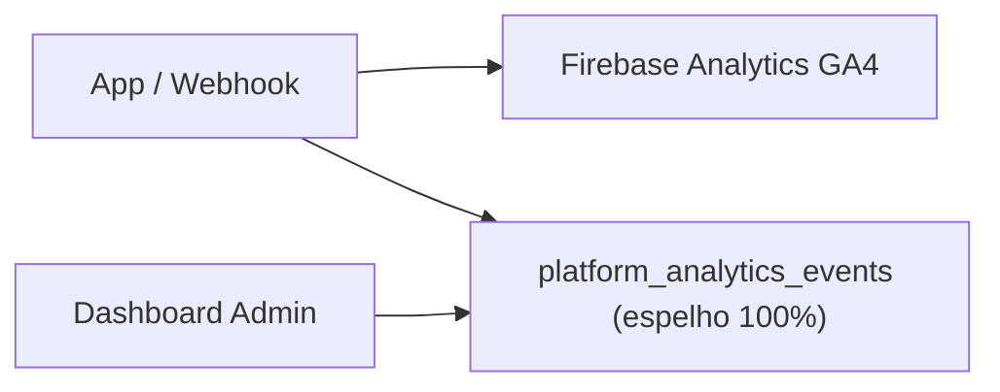

# P1-6 — Analytics Mirror: auditoria pré-implementação

**Data:** 2026-05-19  
**Escopo:** `AppAnalyticsService`, `platform_analytics_events`, Painel Mestre Analytics

---

## 1. Arquitetura anterior

Todo `logEvent()` com `mirror: true` (padrão) duplicava no Firestore.

---

## 2. Pontos de `logEvent()` / espelhamento

### 2.1 AppAnalyticsService

| Método | Evento GA4 | Espelho (antes) |
|--------|------------|-----------------|
| `logSessionStart` | session_start | Sim (1×/dia) |
| `logLogin` | login | Sim |
| `logSignUp` | sign_up | Sim |
| `logScreenView` | screen_view | Não |
| `logFeatureEvent` | vários | **Sim (default)** |
| `logPaywallView` | paywall_view | Sim |
| `logCheckoutStart` | checkout_start + coupon/affiliate/seller | Sim (até 4 docs) |
| `logPurchaseApproved` | purchase + purchase_approved | Sim |
| `logPurchaseCancelled` | purchase_cancelled | Sim |
| `logPurchasePending` | purchase_pending | Sim |

### 2.2 Telas com feature tracking (alta frequência)

| Tela / mixin | Evento |
|--------------|--------|
| `tela_flashcards.dart` | flashcard_study_start |
| `questoes_page.dart` | questions_study_start |
| Simulado | simulado_start / simulado_complete |
| OSCE lobby/estação | osce_lobby_open / osce_station_start |
| Fase prática | practical_phase_open |
| Live events | live_event_join |
| Plans | plans_view |

### 2.3 Cloud Functions

| Origem | Eventos espelhados |
|--------|-------------------|
| `webhook.ts` (Mercado Pago) | purchase_approved, purchase_cancelled, purchase_pending |

### 2.4 Dashboard (`AnalyticsDashboardService`)

- Query: `platform_analytics_events` últimos 30 dias, **limit 3000**
- Agrega in-memory: cadastros, logins, DAU, retenção, conversão, **feature usage**, cupons, afiliados

---

## 3. Dependência Firestore × GA4

| Métrica | GA4 | Firestore (antes) |
|---------|-----|-------------------|
| Funis comerciais | Sim | Sim |
| Uso de produto | Sim | Sim (espelho) |
| Retenção D1/D7/D30 | Sim (cohorts) | Sim (session_start raw) |
| Dashboard admin in-app | Parcial | **100% dependente** |

**GA4 permanece intacto** — espelho era cópia redundante para dashboard.

---

## 4. Estimativa de volume (1.000 DAU)

| Fonte | Writes/mês (estimado) |
|-------|------------------------|
| session_start (1×/dia) | ~30.000 |
| login/signup | ~5.000 |
| **Feature events (~10/sessão)** | **~300.000–900.000** |
| Comercial | ~2.000 |
| **Total** | **~350.000–1.200.000** |

Crescimento da coleção: **ilimitado** (sem TTL/purge).

---

## 5. Estratégia aprovada (Etapa B)

Espelhar **apenas** eventos críticos + `session_start` (retenção/DAU, baixa frequência):

- purchase_approved, purchase_cancelled, checkout_start, paywall_view, sign_up, login, session_start

**Não espelhar:** flashcards, questões, simulados, OSCE, navegação, screen_view, coupon/affiliate/seller isolados, purchase_pending.

Agregação diária `platform_analytics_daily` + purge raw 90 dias.

---

## 6. Riscos / mitigações

| Risco | Mitigação |
|-------|-----------|
| Perder feature usage no dashboard | GA4 (nota no painel) |
| Retenção | session_start espelhado (1×/dia) |
| DAU | subcoleção `active_users` + count aggregation |
| App antigo espelha tudo | Purge + rules; deploy coordenado |
