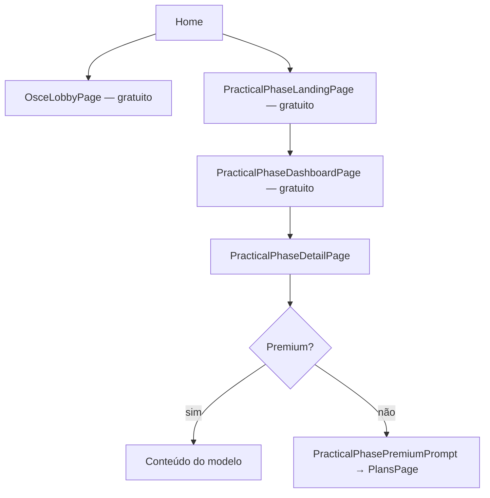

# Fase Prática como primeira feature Premium

**Data:** 2026-05-19  
**Escopo:** Paywall apenas na biblioteca de conteúdo da Fase Prática (modelos/estações).  
**Fora do escopo:** Flashcards, Questões, Cronograma, Simulados, OSCE multiplayer, Live Events.

---

## 1. Auditoria do fluxo (antes da implementação)

### 1.1 Arquitetura de telas

| Tela | Arquivo | Função |
|------|---------|--------|
| Landing | `practical_phase_landing_page.dart` | Hero + grid de **módulos** (`practical_phase_modules`) |
| Dashboard | `practical_phase_dashboard_page.dart` | Lista/filtros de **modelos** (`practical_phase_models`) |
| Detalhe | `practical_phase_detail_page.dart` | Conteúdo: descrição, anexos, seções, itens, treino |
| Admin | `admin_practical_phase_*.dart` | CRUD (sem paywall) |

### 1.2 Pontos de entrada (antes)

| Origem | Destino | Observação |
|--------|---------|------------|
| **Home** → botão “Fase Prática” | `OsceLobbyPage` | **OSCE multiplayer**, não a biblioteca de modelos |
| `PracticalPhaseLandingPage` | — | **Sem link** no app aluno (código órfão) |
| Landing → módulo / hero CTA | `PracticalPhaseDashboardPage` | Navegação interna |
| Dashboard → card modelo | `PracticalPhaseDetailPage` | Conteúdo completo sem gate |
| Módulo com `linkUrl` | URL externa ou dashboard | — |

### 1.3 Dados Firestore

| Coleção | Leitura aluno | Rules |
|---------|---------------|-------|
| `practical_phase_modules` | Módulos publicados | `isSignedIn` + `isPublished` |
| `practical_phase_models` | Modelos publicados/ativos | Idem |

**Nota de segurança:** Rules **não** exigem entitlement Premium — proteção é **UI** (`PaywallGate`). Usuário técnico ainda pode ler documentos via SDK; endurecimento futuro = rules/Functions.

### 1.4 Monetização existente (reutilizada)

| Componente | Uso na Fase Prática |
|------------|---------------------|
| `CommercialEntitlementKey.premium` | Chave exigida no gate |
| `CommercialAccessService.watchAccess` | Via `PaywallGate` |
| `hasPremiumAccess` | Inclui `premium`, `premium_lifetime`, `courtesy_access`, `beta_tester` |
| `PlansPage` | CTA no bloqueio |
| `AppAnalyticsService.logPaywallView` | `screenName: practical_phase_detail` |

---

## 2. Estratégia de monetização aplicada

### 2.1 Princípio “freemium de catálogo”

| Camada | Gratuito | Premium |
|--------|----------|---------|
| Ver módulos na landing | Sim | Sim |
| Ver lista de modelos/estações (dashboard) | Sim | Sim |
| Filtros, busca, cards | Sim | Sim |
| Abrir **detalhe** (roteiro, seções, anexos, treino) | **Não** | Sim |

Alinhado ao pedido: *listar módulos e estações* liberado; *conteúdo premium* bloqueado com tela de assinatura.

### 2.2 O que permanece gratuito (inalterado)

- Flashcards, questões, cronograma, simulados  
- **OSCE** (`OsceLobbyPage`) — botão Home renomeado para clareza: **“Fase Prática — OSCE”**  
- Live Events  
- Navegação landing → dashboard  

### 2.3 Entitlement

```dart
PaywallGate(
  requiredEntitlement: CommercialEntitlementKey.premium,
  // hasPremiumAccess cobre cortesia, vitalício, beta
)
```

---

## 3. Implementação

### 3.1 Arquivos novos

| Arquivo | Descrição |
|---------|-----------|
| `lib/widgets/practical_phase/practical_phase_premium_gate.dart` | `PracticalPhasePremiumGate` + `PracticalPhasePremiumPrompt` (CTA → `PlansPage`) |

### 3.2 Arquivos alterados

| Arquivo | Mudança |
|---------|---------|
| `lib/screens/practical_phase/practical_phase_detail_page.dart` | Corpo do detalhe atrás de `PracticalPhasePremiumGate`; fetch só roda para Premium |
| `lib/screens/home_page.dart` | Botão **Biblioteca Fase Prática** → `PracticalPhaseLandingPage`; OSCE intacto |

### 3.3 Fluxo após implementação



### 3.4 UX do bloqueio

- AppBar “Modelo” visível (contexto da estação escolhida)  
- Mensagem específica Fase Prática + benefícios do restante do app gratuito  
- Botão **“Ver planos e assinar”** → `PlansPage`  
- Evento analytics `paywall_view` com entitlement `premium`  

---

## 4. Matriz de testes manuais

| # | Perfil | Ação | Resultado esperado |
|---|--------|------|-------------------|
| 1 | Gratuito | Home → Biblioteca Fase Prática | Landing com módulos |
| 2 | Gratuito | Hero / módulo → Dashboard | Lista de modelos |
| 3 | Gratuito | Tocar card de modelo | Paywall + CTA planos |
| 4 | Premium | Tocar card de modelo | Detalhe completo |
| 5 | Cortesia/vitalício | Idem 4 | Acesso liberado |
| 6 | Gratuito | Home → Fase Prática — OSCE | Lobby OSCE normal |
| 7 | Gratuito | Flashcards / questões | Sem paywall |

---

## 5. Deploy e operação

1. Publicar app Flutter (sem mudança obrigatória em rules/functions).  
2. Garantir plano Premium ativo no Painel Mestre (checkout MP ou concessão manual).  
3. Validar `paywall_view` no GA4 / espelho Firestore (P1-6).  
4. Comunicar na `PlansPage` que **Fase prática completa** é benefício Premium (`commercial_plan_catalog.dart` já lista).

---

## 6. Backlog recomendado (não feito nesta entrega)

| Item | Prioridade |
|------|------------|
| Rules Firestore: leitura de `practical_phase_models` só com entitlement | P1 segurança |
| Ícone de cadeado nos cards para usuários free | P2 UX |
| Link OsceLobby → Biblioteca (opcional) | P3 descoberta |
| Deep link afiliado/cupom na `PlansPage` | P2 conversão |
| Servir metadados públicos + conteúdo em subcoleção premium | P2 arquitetura |

---

## 7. Relação com auditorias de receita

| Documento | Relação |
|-----------|---------|
| `docs/REVENUE_READINESS_REPORT.md` | Primeira feature com paywall real — reduz gap “paguei e nada mudou” |
| `docs/MVP_COMMERCIAL_IMPLEMENTATION.md` | `PaywallGate` deixa de ser só opt-in teórico |
| `docs/MERCADO_PAGO_IMPLEMENTATION.md` | Premium pós-pagamento desbloqueia detalhe automaticamente via entitlement |

---

## 8. Resumo executivo

| Item | Status |
|------|--------|
| Paywall só Fase Prática (detalhe) | Feito |
| Lista módulos/modelos gratuita | Feito |
| Premium acessa normalmente | Feito |
| OSCE / flashcards / questões / etc. | Inalterados |
| `CommercialAccessService` + entitlements | Integrado |
| CTA `PlansPage` | Feito |
| Entrada Home para biblioteca | Feito (botão novo) |

**Primeira feature Premium vendável:** conteúdo detalhado da biblioteca Fase Prática (modelos, estações, materiais e roteiros).
