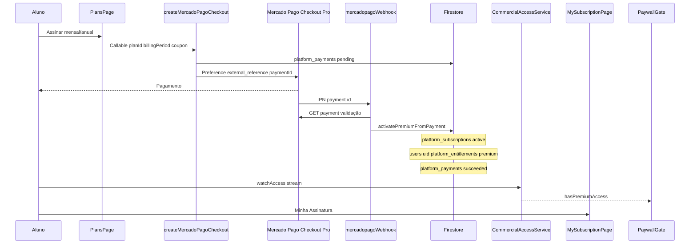

# Auditoria ponta a ponta — Assinatura Premium (produção)

**Data:** 2026-05-19  
**Modo:** Somente leitura (código + rules + índices) — **nenhuma alteração de código**  
**Escopo:** Fluxo Mercado Pago Checkout Pro → Firestore → app aluno → PaywallGate

**Arquivos principais auditados:**  
`lib/screens/commercial/plans_page.dart`, `lib/application/commercial/mercado_pago_checkout_service.dart`, `functions/src/createCheckout.ts`, `functions/src/webhook.ts`, `functions/src/subscriptionService.ts`, `lib/application/commercial/commercial_access_service.dart`, `lib/screens/commercial/my_subscription_page.dart`, `lib/widgets/commercial/paywall_gate.dart`, `lib/widgets/practical_phase/practical_phase_premium_gate.dart`, `firestore.rules`, `firestore.indexes.json`

---

## 1. Mapa do fluxo ponta a ponta

### 1.1 Diagrama lógico

### 1.2 Etapas por componente

| # | Componente | Responsabilidade | Persistência |
|---|------------|------------------|--------------|
| 1 | **PlansPage** | UI planos, cupom opcional, `startCheckout` | — |
| 2 | **MercadoPagoCheckoutService** | Callable `createMercadoPagoCheckout`, abre URL | — |
| 3 | **createMercadoPagoCheckout** | Valida plano/preço, cria pagamento, preferência MP | `platform_payments` pending |
| 4 | **Checkout Pro** | Cobrança, `external_reference` = id do doc pagamento | — |
| 5 | **mercadopagoWebhook** | Valida status na API MP, idempotência `succeeded` | Atualiza payment / subscription / entitlement |
| 6 | **platform_subscriptions** | Período, status, planId, atribuição seller/affiliate/coupon | `platform_subscriptions/{id}` |
| 7 | **platform_entitlements** | Direito `premium` com `expiresAt` | `users/{uid}/platform_entitlements/{id}` |
| 8 | **CommercialAccessService** | Combina assinatura ativa + entitlements válidos + tier plano | Leitura streams |
| 9 | **MySubscriptionPage** | Exibe status, datas, entitlements | — |
| 10 | **PaywallGate** | Bloqueio UI (ex.: Fase Prática detalhe) | — |

### 1.3 Fonte de verdade do acesso Premium

`CommercialAccessService._buildSnapshot` concede `hasPremiumAccess` se **qualquer** destes for verdadeiro:

| Fonte | Condição |
|-------|----------|
| Entitlement válido | `premium`, `premium_lifetime`, `courtesy_access`, `beta_tester` com `isActive` e `expiresAt` não vencido |
| Assinatura + plano | Assinatura “vigente” (`_subscriptionIsCurrentlyActive`) **e** `plan.tier == premium` → injeta chave `premium` no set mesmo sem doc entitlement |

**Implicação:** acesso pode vir **só da assinatura** (tier premium) ou **só do entitlement**; o ideal em produção é ambos alinhados após webhook.

### 1.4 O que o cliente **não** pode escrever (rules)

| Coleção | Create/update cliente |
|---------|------------------------|
| `platform_payments` | **Não** — só Admin SDK (Functions) / admin |
| `platform_subscriptions` | **Não** — só admin manual ou Functions |
| `users/.../platform_entitlements` | **Não** — só `isAppAdmin()` |

→ **Não** há “premium grátis” via manipulação direta no app (exceto conta admin comprometida).

---

## 2. Simulação de cenários

Legenda resultado: **OK** comportamento esperado | **GAP** risco ou lacuna

### 2.1 Compra aprovada (`approved`)

| Passo | Comportamento código | Resultado |
|-------|----------------------|-----------|
| Aluno inicia checkout | `platform_payments` status `pending` | OK |
| MP aprova | Webhook consulta API MP | OK |
| Primeira vez | `activatePremiumFromPayment`: subscription active, entitlement `premium`, payment `succeeded` | OK |
| Reenvio IPN | `localPayment.status === succeeded` → skip activate | OK idempotente |
| App | `watchAccess` → `hasPremiumAccess` true | OK |
| Paywall | Fase Prática detalhe liberado | OK |

**Pré-requisitos produção:** `MERCADOPAGO_ACCESS_TOKEN`, webhook URL no painel MP **e** `notification_url` na preferência (`MERCADOPAGO_WEBHOOK_URL`).

| Risco | Classificação |
|-------|---------------|
| Webhook ausente / URL vazia → paga e não ativa | **P0** operacional |
| Falha após `payment.status=succeeded` e antes do entitlement; retry ignora activate | **P0** (ver §4.1) |
| Janela 5–120 s até IPN: usuário paga e app ainda free | **P1** UX |

---

### 2.2 Compra pendente (`pending` / `in_process`)

| Passo | Comportamento | Resultado |
|-------|---------------|-----------|
| Webhook | Atualiza payment `processing` + `providerPaymentId` | OK |
| Subscription / entitlement | **Não** criados | OK |
| CheckoutReturnPage (se usada) | `logPurchasePending` — **não** concede acesso | OK |
| MySubscriptionPage | Continua gratuito | OK |

| Risco | Classificação |
|-------|---------------|
| Sem job de reconciliação para pendentes antigos | **P1** |
| URL de retorno web sem rota Flutter (`CheckoutReturnPage` não registrada em `main.dart`) | **P1** |

---

### 2.3 Compra recusada / cancelada (`rejected` / `cancelled` / `expired`)

| Passo | Comportamento | Resultado |
|-------|---------------|-----------|
| Webhook | `cancelSubscriptionFromPayment` + payment `canceled` + analytics `purchase_cancelled` | Parcial |
| Subscription no payment | Só cancela subscription **se** `payment.subscriptionId` existir | OK se nunca aprovado |
| Entitlements | `deactivatePremiumEntitlementsForSubscription(userId, subscriptionId)` | **GAP** |

**GAP crítico:** se o pagamento **nunca** foi aprovado, `subscriptionId` no payment é `undefined`. O filtro `if (subscriptionId && data.subscriptionId !== subscriptionId) continue` **não** aplica — o código desativa **todos** os entitlements ativos com chave `premium` do usuário.

| Cenário | Efeito |
|---------|--------|
| Usuário com Premium **válido** tenta renovar; pagamento falha | Pode **perder** entitlement `premium` da compra anterior |
| Usuário só cortesia (`courtesy_access`) | Chave `premium` não afetada → OK |
| Usuário vitalício (`premium_lifetime`) | Preservado no loop → OK |

| Classificação |
|---------------|
| **P0** — perda de acesso pago / financeira |

---

### 2.4 Reembolso (`refunded` / `charged_back`)

| Passo | Comportamento | Resultado |
|-------|---------------|-----------|
| Webhook | `refundSubscriptionFromPayment` → payment `refunded`, sub `canceled` | OK |
| Entitlements | Desativa `premium` **somente** com `subscriptionId` igual ao do pagamento | OK |
| lifetime / courtesy / beta | Ignorados no deactivate | OK |

| Risco | Classificação |
|-------|---------------|
| Reembolso parcial MP vs. lógica binária | **P2** |

---

### 2.5 Expiração de assinatura

| Mecanismo | Comportamento | Resultado |
|-----------|---------------|-----------|
| **Tempo real (app)** | `expiresAt` no entitlement; `isValidNow` false após data | OK acesso cortado |
| | `_subscriptionIsCurrentlyActive` false se `currentPeriodEnd` passou | OK |
| **Job** `expireSubscriptionsScheduled` | 06:00 America/Sao_Paulo; query `active` + `currentPeriodEnd < now`; limit **100**/execução | Parcial |
| Job | Marca subscription `expired`, desativa entitlement `premium` daquela subscription | OK |

| Risco | Classificação |
|-------|---------------|
| >100 assinaturas vencidas/dia → fila não esvazia no mesmo dia | **P1** |
| Até ~24h status Firestore `active` com período vencido (app já nega acesso) | **P2** |

---

### 2.6 Renovação manual (nova compra Checkout Pro)

| Passo | Comportamento | Resultado |
|-------|---------------|-----------|
| Já ativo, nova compra aprovada | Estende `currentPeriodEnd` se sub ainda ativa; upsert entitlement `expiresAt` | OK |
| Novo payment doc | Sem `subscriptionId` inicial → pode criar **nova** doc em `platform_subscriptions` | **GAP** |
| `watchActiveForUser` | `limit(1)` em subs `active`/`trialing` — escolha **não determinística** se várias | **P2** |

Não há cobrança recorrente automática (PreApproval MP) — renovação = **novo** checkout.

---

### 2.7 Usuário Premium vitalício (admin)

| Item | Comportamento | Resultado |
|------|---------------|-----------|
| Grant | `CommercialEntitlementKey.premiumLifetime`, `expiresAt` null | OK |
| `hasPremiumAccess` | Incluído em `premiumAccessKeys` | OK |
| Webhook refund/cancel | Não remove lifetime | OK |
| Webhook reject de **outro** pagamento | Não remove lifetime | OK |

---

### 2.8 Usuário cortesia

| Item | Comportamento | Resultado |
|------|---------------|-----------|
| Grant | Chave `courtesy_access` | OK |
| Paywall | `hasPremiumAccess` true | OK |
| Falha pagamento MP | Não remove cortesia (só chave `premium`) | OK |

---

### 2.9 Usuário beta

| Item | Comportamento | Resultado |
|------|---------------|-----------|
| Grant | `beta_tester` | OK |
| Paywall | Liberado | OK |
| Expiração | Por `expiresAt` em entitlement | OK |

---

## 3. Matriz “perguntas de risco” da auditoria

| Pergunta | Achado | Severidade |
|----------|--------|------------|
| Usuário paga e não recebe acesso? | Sim, se webhook falhar, URL IPN vazia, ou falha pós-`succeeded` sem entitlement | **P0** |
| Usuário recebe acesso sem pagar? | Cliente não grava payment/sub/entitlement. Admin manual é intencional. | OK (admin = **P2** governança) |
| Assinatura ativa após expiração? | App nega por data; job pode atrasar status `expired` | **P2** |
| Webhook falha silenciosamente? | Vários `200` sem processar; `500` loga erro; 404 em payment local | **P1** |

---

## 4. Achados detalhados por severidade

### P0 — Perda financeira / acesso pago

| ID | Achado | Evidência | Impacto |
|----|--------|-----------|---------|
| **P0-1** | **`notification_url` opcional** — se `MERCADOPAGO_WEBHOOK_URL` vazio, preferência sem IPN | `createCheckout.ts` L93–116 | Pagamento aprovado no MP **sem** ativação automática |
| **P0-2** | **Idempotência quebra entitlement** — se `platform_payments.status` já é `succeeded` mas entitlement nunca foi criado (crash entre passos), retry retorna cedo | `subscriptionService.ts` L35–37 | Pago, subscription pode existir, **sem** premium no app |
| **P0-3** | **Pagamento recusado remove Premium válido** — `deactivatePremiumEntitlementsForSubscription(userId, undefined)` desativa **todo** entitlement `premium` ativo | `subscriptionService.ts` L246–258 + `webhook.ts` L127–135 | Cliente pago perde acesso após tentativa de compra falha |
| **P0-4** | **Dependência total do webhook** — app não ativa premium no retorno do browser; `CheckoutReturnPage` só analytics | `checkout_return_page.dart`, sem rota em `main.dart` | Janela “paguei e nada mudou” até IPN (ou eterna se P0-1) |

**Checklist produção P0:**

- [ ] `MERCADOPAGO_WEBHOOK_URL` = URL pública `mercadopagoWebhook`
- [ ] Painel MP → Webhooks → eventos `payment`
- [ ] Teste sandbox: approved → docs `succeeded` / entitlement / Minha Assinatura
- [ ] Monitorar logs `mercadopagoWebhook error` e alertas 500

---

### P1 — Falha operacional

| ID | Achado | Evidência | Impacto |
|----|--------|-----------|---------|
| **P1-1** | Webhook retorna **404** se `platform_payments` não existe | `webhook.ts` L75–77 | MP pode reintentar; ruído operacional |
| **P1-2** | Webhook retorna **200** sem processar (`no external reference`, `ignored` topic) | `webhook.ts` L41–53, L67–69 | Falhas silenciosas difíceis de auditar |
| **P1-3** | **Sem transação Firestore** em `activatePremiumFromPayment` | Várias escritas sequenciais | Estados inconsistentes (duplicar sub, payment succeeded sem entitlement) |
| **P1-4** | **Expire job limit 100**/dia | `expireDueSubscriptions` L270 | Backlog em picos de expiração |
| **P1-5** | **Múltiplas assinaturas `active`** após recompras | Novo doc por checkout; `watchActiveForUser` limit 1 | Métricas/admin confusas; edge cases de status |
| **P1-6** | **Pendentes sem reconciliação** agendada | Só update `processing` | Pagamentos aprovados tardiamente no MP podem ficar sem activate se IPN perdido |
| **P1-7** | **CheckoutReturnPage** não integrada ao router | Sem referência em `main.dart` | back_urls web possivelmente 404; UX pós-pagamento fraca |

---

### P2 — Melhoria

| ID | Achado | Evidência | Impacto |
|----|--------|-----------|---------|
| **P2-1** | Cupom: `resolveCouponId` ignora código inválido; **sem desconto** no `unit_price` | `createCheckout.ts`, `MERCADO_PAGO_IMPLEMENTATION.md` | Expectativa comercial vs. cobrança |
| **P2-2** | Cupom sem validar `maxUses`, `validUntil` no checkout | `resolveCouponId` só `isActive` | Uso indevido |
| **P2-3** | `CheckoutReturnPage` dispara `logPurchaseApproved` antes do webhook | Analytics inflado | Métricas conversão distorcidas |
| **P2-4** | Dupla via de acesso: subscription tier premium **ou** entitlement | `commercial_access_service.dart` L95–98 | Divergência se apenas um atualizado |
| **P2-5** | Sem renovação automática (Checkout Pro avulso) | Design documentado | Churn por esquecimento |
| **P2-6** | Paywall só em Fase Prática (detalhe); conteúdo Firestore ainda legível via SDK | `firestore.rules` practical_phase | Enforcement só UI |
| **P2-7** | Concessão manual admin = acesso sem pagamento | `CommercialAdminService` | Aceitável; exige RBAC forte |
| **P2-8** | `providerPaymentId` sobrescrito (preferenceId → payment id MP) | Fluxo normal | OK para suporte; documentar |

---

## 5. Webhook — superfície de falha silenciosa

| Resposta HTTP | Quando | Risco |
|---------------|--------|-------|
| `200 ok` | Sem `data.id` / sem `external_reference` | IPN ignorado sem alerta |
| `200 ignored` | Topic não é payment | Pode ignorar evento legítimo mal formatado |
| `404` | Payment MP ou local não encontrado | Reintentos MP |
| `500 error` | Exceção (log `console.error`) | MP reintenta — **bom** |
| `200 ok` | Sucesso | — |

**Recomendação operacional:** métricas/alertas em `500`, contador de `200` com body “no external reference”, e dashboard de `platform_payments` pending > 24h.

---

## 6. Integração PaywallGate × CommercialAccessService

| Verificação | Status |
|-------------|--------|
| Usa `PlatformRegistry.instance.commercialAccess` | OK |
| `CommercialEntitlementKey.premium` + `hasPremiumAccess` | OK |
| CTA `PlansPage` no bloqueio | OK (`paywall_gate.dart`, `practical_phase_premium_gate.dart`) |
| Stream reativo após webhook | OK (entitlements + subscriptions snapshots) |
| Admin isAppAdmin | Não bypassa PaywallGate no código aluno | OK |

---

## 7. MySubscriptionPage

| Verificação | Status |
|-------------|--------|
| Reflete `CommercialAccessSnapshot` | OK |
| Diferencia lifetime / cortesia / beta / ativo / expirado | OK |
| Não reativa pagamento (só link Planos) | OK |
| Pode mostrar “Ativo” via subscription enquanto entitlement já expirou se lógica divergir | **P2-4** edge |

---

## 8. Plano de ação recomendado (pós-auditoria)

**Ordem sugerida (correções de código — fora deste documento):**

1. **P0-3** — Em `cancel`/`reject`, não desativar entitlement `premium` se `payment.status !== succeeded` ou se `subscriptionId` ausente.
2. **P0-2** — Em idempotência `succeeded`, garantir `upsertPremiumEntitlement` se entitlement ausente.
3. **P0-1** — Falhar checkout se `MERCADOPAGO_WEBHOOK_URL` vazio em produção.
4. **P1-3** — Transação batch Firestore em `activatePremiumFromPayment`.
5. **P1-4** — Paginar `expireDueSubscriptions` até esvaziar.
6. **P1-6** — Scheduled reconciliation: pending/processing → consulta MP API.
7. **P1-7** — Rotas `/checkout/*` ou deep link + polling `watchAccess` pós-retorno.

**Validação em produção (sem código):**

| Teste | Verificação |
|-------|-------------|
| Sandbox approved | payment `succeeded`, entitlement `premium`, Paywall libera |
| Sandbox rejected (2ª tentativa com Premium ativo) | **Não** deve remover entitlement P0-3 |
| Cortesia + reject | Cortesia mantida |
| Refund | Premium removido; lifetime mantido |
| Após `currentPeriodEnd` | Paywall bloqueia; entitlement `isActive` false pós job |

---

## 9. Resumo executivo

| Área | Avaliação produção |
|------|-------------------|
| Arquitetura geral | **Sólida** — server-side activation, rules impedem auto-grant no cliente |
| Caminho feliz (webhook OK) | **OK** |
| Falhas de pagamento / idempotência | **Risco P0** |
| Configuração MP / IPN | **Crítico P0** se URL não configurada |
| Expiração | **OK no app**; job com limite 100 (**P1**) |
| Cortesia / vitalício / beta | **OK** |
| Paywall + Minha Assinatura | **OK** integrados ao mesmo serviço de acesso |

**Veredito:** **Não considerar o fluxo “blindado para produção”** até mitigar **P0-1 a P0-4** (config + código). O caminho feliz funciona; os cenários de falha de pagamento e de webhook expõem perda de receita e de acesso indevidamente revogado.

---

*Auditoria estática — validar com testes sandbox/produção, logs Cloud Functions e amostra de documentos Firestore reais.*
